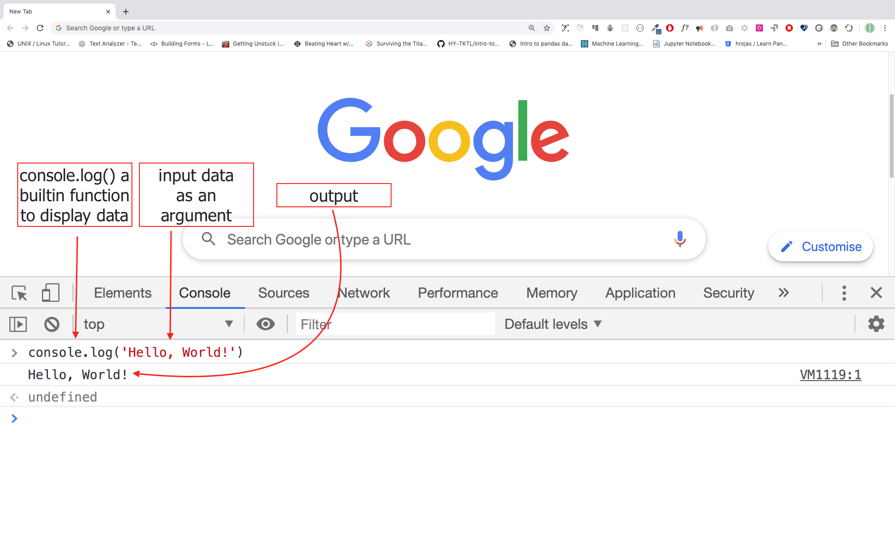
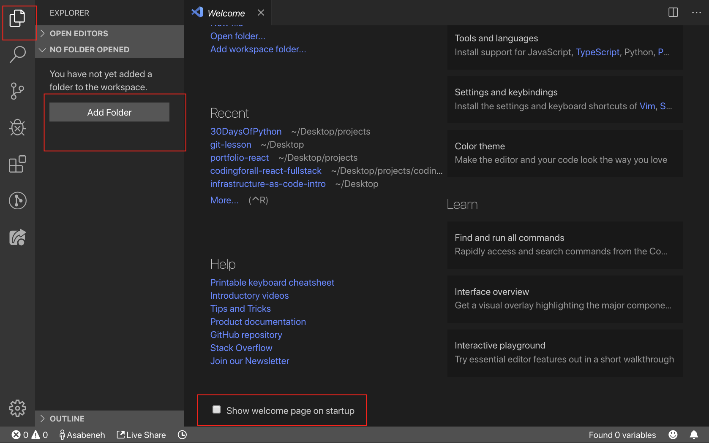
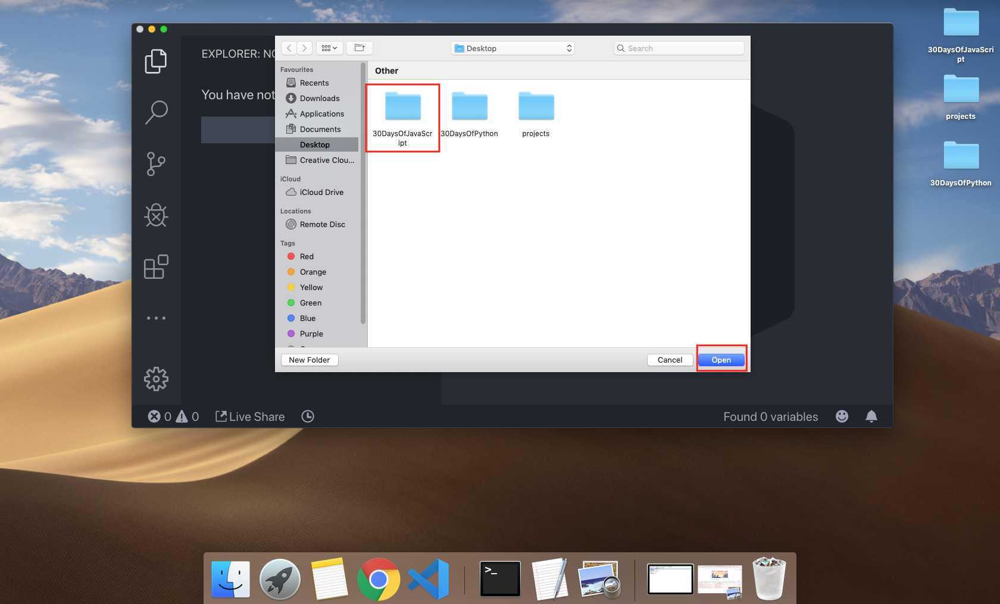
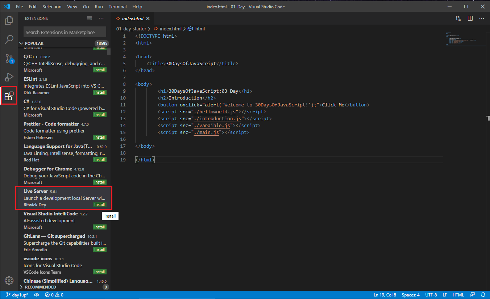
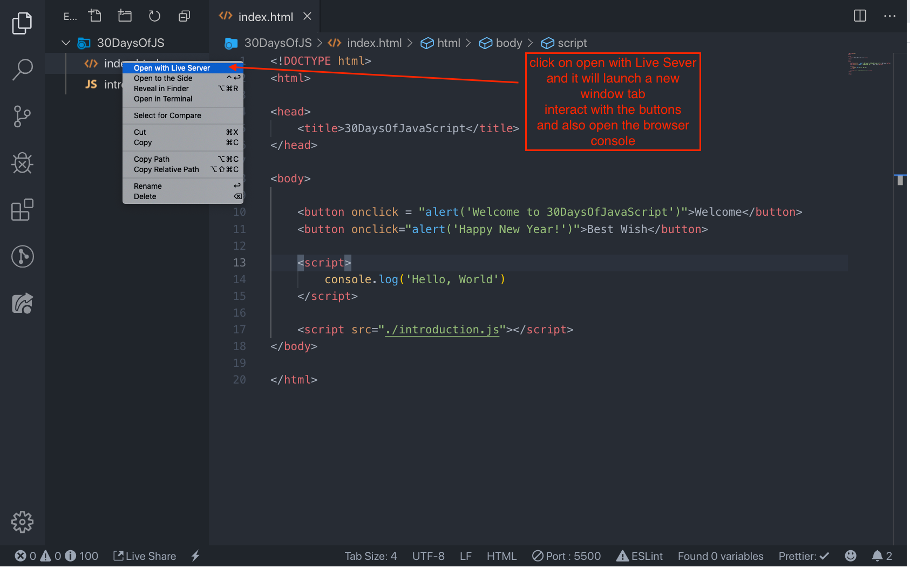
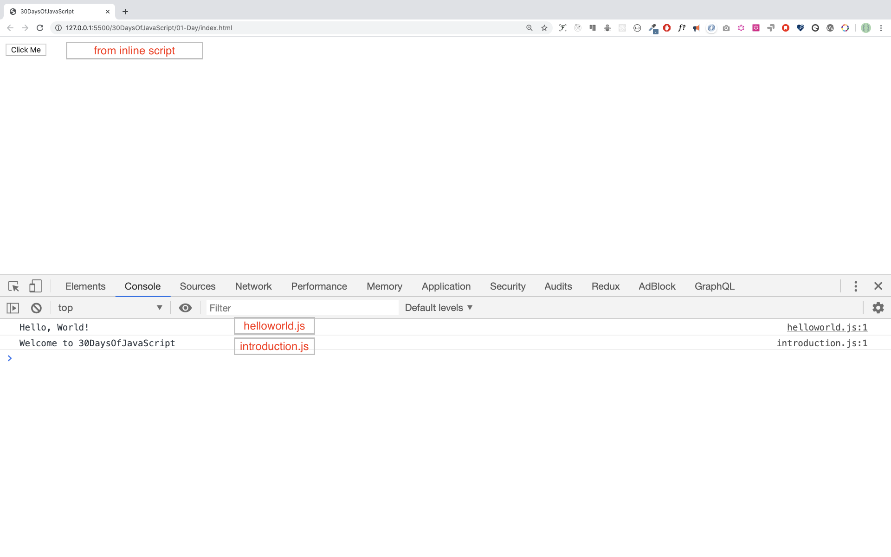

# 📔 Hari 1

## Pendahuluan

**Selamat** atas keputusan Anda untuk berpartisipasi dalam tantangan pemrograman JavaScript 30 hari. Dalam tantangan ini Anda akan mempelajari semua yang Anda butuhkan untuk menjadi seorang programmer JavaScript, dan secara umum, seluruh konsep pemrograman. Di akhir tantangan Anda akan mendapatkan sertifikat penyelesaian tantangan pemrograman 30DaysOfJavaScript. Jika Anda membutuhkan bantuan atau jika Anda ingin membantu orang lain, Anda dapat bergabung dengan [grup telegram](https://t.me/ThirtyDaysOfJavaScript).

**Tantangan 30DaysOfJavaScript** adalah panduan untuk pengembang JavaScript pemula maupun mahir. Selamat datang di JavaScript. JavaScript adalah bahasa web. Saya menikmati menggunakan dan mengajarkan JavaScript dan saya harap Anda juga akan demikian.

Dalam tantangan JavaScript langkah demi langkah ini, Anda akan mempelajari JavaScript, bahasa pemrograman paling populer dalam sejarah umat manusia.
JavaScript digunakan **_untuk menambahkan interaktivitas ke situs web, untuk mengembangkan aplikasi seluler, aplikasi desktop, game_** dan saat ini JavaScript dapat digunakan untuk **_machine learning_** dan **_AI_**.
**_JavaScript (JS)_** telah meningkat popularitasnya dalam beberapa tahun terakhir dan telah menjadi bahasa pemrograman terdepan selama enam tahun berturut-turut serta merupakan bahasa pemrograman yang paling banyak digunakan di Github.

## Persyaratan

Tidak diperlukan pengetahuan pemrograman sebelumnya untuk mengikuti tantangan ini. Anda hanya perlu:

1. Motivasi
2. Komputer
3. Internet
4. Browser
5. Editor kode

## Persiapan

Saya yakin Anda memiliki motivasi dan keinginan kuat untuk menjadi seorang pengembang, komputer, dan Internet. Jika Anda memilikinya, maka Anda memiliki segalanya untuk memulai.

### Instal Node.js

Anda mungkin belum membutuhkan Node.js saat ini tetapi Anda mungkin membutuhkannya nanti. Instal [node.js](https://nodejs.org/en/).


Setelah mengunduh, klik dua kali dan instal


Kita dapat memeriksa apakah node terinstal di mesin lokal kita dengan membuka terminal perangkat atau command prompt.

```sh
asabeneh $ node -v
v12.14.0
```

Saat membuat tutorial ini saya menggunakan Node versi 12.14.0, tetapi sekarang versi Node.js yang direkomendasikan untuk diunduh adalah v14.17.6, pada saat Anda menggunakan materi ini Anda mungkin memiliki versi Node.js yang lebih tinggi.

### Browser

Ada banyak browser di luar sana. Namun, saya sangat merekomendasikan Google Chrome.

#### Menginstal Google Chrome

Instal [Google Chrome](https://www.google.com/chrome/) jika Anda belum memilikinya. Kita dapat menulis kode JavaScript kecil di konsol browser, tetapi kita tidak menggunakan konsol browser untuk mengembangkan aplikasi.


#### Membuka Konsol Google Chrome

Anda dapat membuka konsol Google Chrome dengan mengklik tiga titik di sudut kanan atas browser, memilih _Alat lainnya -> Alat pengembang_ atau menggunakan pintasan keyboard. Saya lebih suka menggunakan pintasan.


Untuk membuka konsol Chrome menggunakan pintasan keyboard.

```sh
Mac
Command+Option+J

Windows/Linux:
Ctl+Shift+J
```


Setelah Anda membuka konsol Google Chrome, coba jelajahi tombol-tombol yang ditandai. Kita akan menghabiskan sebagian besar waktu di Konsol. Konsol adalah tempat kode JavaScript Anda berjalan. Mesin Google Console V8 mengubah kode JavaScript Anda menjadi kode mesin.
Mari kita tulis kode JavaScript di konsol Google Chrome:



#### Menulis Kode di Konsol Browser

Kita dapat menulis kode JavaScript apa pun di konsol Google atau konsol browser apa pun. Namun, untuk tantangan ini, kita hanya fokus pada konsol Google Chrome. Buka konsol menggunakan:

```sh
Mac
Command+Option+I

Windows:
Ctl+Shift+I
```

##### Console.log

Untuk menulis kode JavaScript pertama kita, kita menggunakan fungsi bawaan **console.log()**. Kita memberikan argumen sebagai data masukan, dan fungsi tersebut menampilkan keluaran. Kita memberikan `'Hello, World'` sebagai data masukan atau argumen dalam fungsi console.log().

```js
console.log('Hello, World!')
```

##### Console.log dengan Beberapa Argumen

Fungsi **`console.log()`** dapat menerima beberapa parameter yang dipisahkan oleh koma. Sintaksnya terlihat sebagai berikut:**`console.log(param1, param2, param3)`**


```js
console.log('Hello', 'World', '!')
console.log('HAPPY', 'NEW', 'YEAR', 2020)
console.log('Welcome', 'to', 30, 'Days', 'Of', 'JavaScript')
```

Seperti yang Anda lihat dari potongan kode di atas, _`console.log()`_ dapat menerima beberapa argumen.

Selamat! Anda telah menulis kode JavaScript pertama Anda menggunakan _`console.log()`_.

##### Komentar

Kita dapat menambahkan komentar ke kode kita. Komentar sangat penting untuk membuat kode lebih mudah dibaca dan untuk meninggalkan catatan dalam kode kita. JavaScript tidak mengeksekusi bagian komentar dari kode kita. Di JavaScript, setiap baris teks yang dimulai dengan // di JavaScript adalah komentar, dan apa pun yang diapit seperti ini `//` juga merupakan komentar.

**Contoh: Komentar Satu Baris**

```js
// Ini adalah komentar pertama  
// Ini adalah komentar kedua  
// Saya adalah komentar satu baris
```

**Contoh: Komentar Banyak Baris**

```js
/*
Ini adalah komentar banyak baris  
 Komentar banyak baris dapat mengambil beberapa baris  
 JavaScript adalah bahasa web  
 */
```

##### Sintaks

Bahasa pemrograman mirip dengan bahasa manusia. Bahasa Inggris atau banyak bahasa lain menggunakan kata, frasa, kalimat, kalimat majemuk dan lainnya untuk menyampaikan pesan yang bermakna. Arti sintaks dalam bahasa Inggris adalah _susunan kata dan frasa untuk membuat kalimat yang terbentuk dengan baik dalam suatu bahasa_. Definisi teknis sintaks adalah struktur pernyataan dalam bahasa komputer. Bahasa pemrograman memiliki sintaks. JavaScript adalah bahasa pemrograman dan seperti bahasa pemrograman lainnya, ia memiliki sintaksnya sendiri. Jika kita tidak menulis sintaks yang dipahami JavaScript, ia akan menimbulkan berbagai jenis kesalahan. Kita akan mengeksplorasi berbagai jenis kesalahan JavaScript nanti. Untuk saat ini, mari kita lihat kesalahan sintaks.


Saya sengaja membuat kesalahan. Akibatnya, konsol menimbulkan kesalahan sintaks. Sebenarnya, sintaksnya sangat informatif. Ia memberi tahu jenis kesalahan apa yang dibuat. Dengan membaca panduan umpan balik kesalahan, kita dapat memperbaiki sintaks dan memperbaiki masalah. Proses mengidentifikasi dan menghapus kesalahan dari program disebut debugging. Mari kita perbaiki kesalahannya:

```js
console.log('Hello, World!')
console.log('Hello, World!')
```

Sejauh ini, kita telah melihat cara menampilkan teks menggunakan _`console.log()`_. Jika kita mencetak teks atau string menggunakan _`console.log()`_, teks tersebut harus berada di dalam tanda kutip tunggal, tanda kutip ganda, atau backtick.
**Contoh:**

```js
console.log('Hello, World!')
console.log("Hello, World!")
console.log(`Hello, World!`)
```

#### Aritmatika

Sekarang, mari kita berlatih lebih banyak menulis kode JavaScript menggunakan _`console.log()`_ di konsol Google Chrome untuk tipe data angka.
Selain teks, kita juga dapat melakukan perhitungan matematika menggunakan JavaScript. Mari kita lakukan perhitungan sederhana berikut.
Kita dapat menulis kode JavaScript di konsol Google Chrome secara langsung tanpa fungsi **_`console.log()`_**. Namun, ini disertakan dalam pendahuluan ini karena sebagian besar tantangan ini akan berlangsung di editor teks di mana penggunaan fungsi tersebut wajib. Anda dapat bermain-main langsung dengan instruksi di konsol.


```js
console.log(2 + 3) // Penjumlahan
console.log(3 - 2) // Pengurangan
console.log(2 * 3) // Perkalian
console.log(3 / 2) // Pembagian
console.log(3 % 2) // Modulus - mencari sisa
console.log(3 ** 2) // Eksponensiasi 3 ** 2 == 3 * 3
```

### Editor Kode

Kita dapat menulis kode kita di konsol browser, tetapi itu tidak cocok untuk proyek yang lebih besar. Di lingkungan kerja nyata, pengembang menggunakan berbagai editor kode untuk menulis kode mereka. Dalam tantangan JavaScript 30 hari ini, kita akan menggunakan Visual Studio Code.

#### Menginstal Visual Studio Code

Visual Studio Code adalah editor teks sumber terbuka yang sangat populer. Saya akan merekomendasikan untuk [mengunduh Visual Studio Code](https://code.visualstudio.com/), tetapi jika Anda lebih menyukai editor lain, silakan ikuti dengan apa yang Anda miliki.


Jika Anda telah menginstal Visual Studio Code, mari kita mulai menggunakannya.

#### Cara Menggunakan Visual Studio Code

Buka Visual Studio Code dengan mengklik dua kali ikonnya. Saat Anda membukanya, Anda akan mendapatkan antarmuka seperti ini. Cobalah berinteraksi dengan ikon-ikon yang diberi label.












## Menambahkan JavaScript ke Halaman Web

JavaScript dapat ditambahkan ke halaman web dengan tiga cara berbeda:

- **_Inline script_**
- **_Internal script_**
- **_External script_**
- **_Multiple External scripts_**

Bagian berikut menunjukkan berbagai cara menambahkan kode JavaScript ke halaman web Anda.

### Inline Script

Buat folder proyek di desktop Anda atau di lokasi mana pun, beri nama 30DaysOfJS dan buat file **_`index.html`_** di folder proyek. Kemudian tempelkan kode berikut dan buka di browser, misalnya [Chrome](https://www.google.com/chrome/).

```html
<!DOCTYPE html>
<html lang="en">
  <head>
    <title>30DaysOfScript:Inline Script</title>
  </head>
  <body>
    <button onclick="alert('Welcome to 30DaysOfJavaScript!')">Click Me</button>
  </body>
</html>
```

Sekarang, Anda baru saja menulis inline script pertama Anda. Kita dapat membuat pesan peringatan pop up menggunakan fungsi bawaan _`alert()`_.

### Internal Script

Internal script dapat ditulis di _`head`_ atau _`body`_, tetapi lebih disarankan untuk menempatkannya di body dokumen HTML.
Pertama, mari kita tulis di bagian head halaman.

```html
<!DOCTYPE html>
<html lang="en">
  <head>
    <title>30DaysOfScript:Internal Script</title>
    <script>
      console.log('Welcome to 30DaysOfJavaScript')
    </script>
  </head>
  <body></body>
</html>
```

Ini adalah cara kita menulis internal script sebagian besar waktu. Menulis kode JavaScript di bagian body adalah opsi yang paling disarankan. Buka konsol browser untuk melihat keluaran dari `console.log()`.

```html
<!DOCTYPE html>
<html lang="en">
  <head>
    <title>30DaysOfScript:Internal Script</title>
  </head>
  <body>
    <button onclick="alert('Welcome to 30DaysOfJavaScript!');">Click Me</button>
    <script>
      console.log('Welcome to 30DaysOfJavaScript')
    </script>
  </body>
</html>
```

Buka konsol browser untuk melihat keluaran dari `console.log()`.


### External Script

Mirip dengan internal script, tautan external script dapat berada di header atau body, tetapi lebih disarankan untuk menempatkannya di body.
Pertama, kita harus membuat file JavaScript eksternal dengan ekstensi .js. Semua file yang berakhiran .js adalah file JavaScript. Buat file bernama introduction.js di dalam direktori proyek Anda dan tulis kode berikut dan tautkan file .js ini di bagian bawah body.

```js
console.log('Welcome to 30DaysOfJavaScript')
```

External scripts di _head_:

```html
<!DOCTYPE html>
<html lang="en">
  <head>
    <title>30DaysOfJavaScript:External script</title>
    <script src="introduction.js"></script>
  </head>
  <body></body>
</html>
```

External scripts di _body_:

```html
<!DOCTYPE html>
<html lang="en">
  <head>
    <title>30DaysOfJavaScript:External script</title>
  </head>
  <body>
    <!-- Tautan eksternal JavaScript bisa di header atau di body --> 
    <!-- Sebelum tag penutup body adalah tempat yang direkomendasikan untuk meletakkan script JavaScript eksternal -->
    <script src="introduction.js"></script>
  </body>
</html>
```

Buka konsol browser untuk melihat keluaran dari `console.log()`.

### Multiple External Scripts

Kita juga dapat menautkan beberapa file JavaScript eksternal ke halaman web.
Buat file `helloworld.js` di dalam folder 30DaysOfJS dan tulis kode berikut.

```js
console.log('Hello, World!')
```

```html
<!DOCTYPE html>
<html lang="en">
  <head>
    <title>Multiple External Scripts</title>
  </head>
  <body>
    <script src="./helloworld.js"></script>
    <script src="./introduction.js"></script>
  </body>
</html>
```

_File main.js Anda harus berada di bawah semua script lainnya_. Sangat penting untuk mengingat ini.



## Pengenalan Tipe Data

Di JavaScript dan juga bahasa pemrograman lainnya, ada berbagai jenis tipe data. Berikut adalah tipe data primitif JavaScript: _String, Number, Boolean, undefined, Null_, dan _Symbol_.

### Numbers

- Integers: Bilangan bulat (negatif, nol, dan positif)
  Contoh:
  ... -3, -2, -1, 0, 1, 2, 3 ...
- Float-point numbers: Bilangan desimal
  Contoh
  ... -3.5, -2.25, -1.0, 0.0, 1.1, 2.2, 3.5 ...

### Strings

Kumpulan satu atau lebih karakter di antara dua tanda kutip tunggal, tanda kutip ganda, atau backtick.

**Contoh:**

```js
'a'
'Asabeneh'
"Asabeneh"
'Finland'
'JavaScript is a beautiful programming language'
'I love teaching'
'I hope you are enjoying the first day'
`We can also create a string using a backtick`
'A string could be just as small as one character or as big as many pages'
'Any data type under a single quote, double quote or backtick is a string'
```

### Booleans

Nilai boolean adalah True atau False. Setiap perbandingan mengembalikan nilai boolean, yang bisa true atau false.

Tipe data boolean adalah nilai true atau false.

**Contoh:**

```js
true // jika lampu menyala, nilainya true
false // jika lampu mati, nilainya false
```

### Undefined

Di JavaScript, jika kita tidak memberikan nilai ke variabel, nilainya adalah undefined. Selain itu, jika sebuah fungsi tidak mengembalikan apa pun, ia mengembalikan undefined.

```js
let firstName
console.log(firstName) // undefined, karena belum diberikan nilai
```

### Null

Null di JavaScript berarti nilai kosong.

```js
let emptyValue = null
```

## Memeriksa Tipe Data

Untuk memeriksa tipe data dari variabel tertentu, kita menggunakan operator **typeof**. Lihat contoh berikut.

```js
console.log(typeof 'Asabeneh') // string
console.log(typeof 5) // number
console.log(typeof true) // boolean
console.log(typeof null) // object type
console.log(typeof undefined) // undefined
```

## Komentar Lagi

Ingat bahwa mengomentari di JavaScript mirip dengan bahasa pemrograman lainnya. Komentar penting untuk membuat kode Anda lebih mudah dibaca.
Ada dua cara mengomentari:

- _Komentar satu baris_
- _Komentar banyak baris_

```js
// mengomentari kode itu sendiri dengan komentar tunggal
// let firstName = 'Asabeneh'; komentar satu baris
// let lastName = 'Yetayeh'; komentar satu baris
```

Komentar banyak baris:

```js
/*
  let location = 'Helsinki';
  let age = 100;
  let isMarried = true;
  Ini adalah komentar banyak baris
*/
```

## Variabel

Variabel adalah _wadah_ data. Variabel digunakan untuk _menyimpan_ data di lokasi memori. Ketika sebuah variabel dideklarasikan, lokasi memori dicadangkan. Ketika sebuah variabel diberi nilai (data), ruang memori akan diisi dengan data tersebut. Untuk mendeklarasikan variabel, kita menggunakan kata kunci _var_, _let_, atau _const_.

Untuk variabel yang berubah pada waktu yang berbeda, kita menggunakan _let_. Jika data tidak berubah sama sekali, kita menggunakan _const_. Misalnya, PI, nama negara, gravitasi tidak berubah, dan kita dapat menggunakan _const_. Kita tidak akan menggunakan var dalam tantangan ini dan saya tidak merekomendasikan Anda untuk menggunakannya. Ini adalah cara mendeklarasikan variabel yang rawan kesalahan dan memiliki banyak kebocoran. Kita akan membahas lebih lanjut tentang var, let, dan const secara detail di bagian lain (scope). Untuk saat ini, penjelasan di atas sudah cukup.

Nama variabel JavaScript yang valid harus mengikuti aturan berikut:

- Nama variabel JavaScript tidak boleh dimulai dengan angka.
- Nama variabel JavaScript tidak mengizinkan karakter khusus kecuali tanda dolar dan garis bawah.
- Nama variabel JavaScript mengikuti konvensi camelCase.
- Nama variabel JavaScript tidak boleh memiliki spasi di antara kata.

Berikut adalah contoh variabel JavaScript yang valid.

```js
firstName
lastName
country
city
capitalCity
age
isMarried

first_name
last_name
is_married
capital_city

num1
num_1
_num_1
$num1
year2020
year_2020
```

Variabel pertama dan kedua dalam daftar mengikuti konvensi camelCase dalam mendeklarasikan di JavaScript. Dalam materi ini, kita akan menggunakan variabel camelCase(camelWithOneHump). Kita menggunakan CamelCase(CamelWithTwoHump) untuk mendeklarasikan kelas, kita akan membahas tentang kelas dan objek di bagian lain.

Contoh variabel yang tidak valid:

```js
  first-name
  1_num
  num_#_1
```

Mari kita deklarasikan variabel dengan tipe data yang berbeda. Untuk mendeklarasikan variabel, kita perlu menggunakan kata kunci _let_ atau _const_ sebelum nama variabel. Setelah nama variabel, kita menulis tanda sama dengan (operator penugasan), dan nilai (data yang ditugaskan).

```js
// Sintaks
let nameOfVariable = value
```

Nama nameOfVriable adalah nama yang menyimpan data nilai yang berbeda. Lihat di bawah untuk contoh detail.

**Contoh variabel yang dideklarasikan**

```js
// Mendeklarasikan variabel berbeda dari tipe data yang berbeda
let firstName = 'Asabeneh' // nama depan seseorang
let lastName = 'Yetayeh' // nama belakang seseorang
let country = 'Finland' // negara
let city = 'Helsinki' // ibu kota
let age = 100 // usia dalam tahun
let isMarried = true

console.log(firstName, lastName, country, city, age, isMarried)
```

```sh
Asabeneh Yetayeh Finland Helsinki 100 true
```

```js
// Mendeklarasikan variabel dengan nilai angka
let age = 100 // usia dalam tahun
const gravity = 9.81 // gravitasi bumi dalam m/s2
const boilingPoint = 100 // titik didih air, suhu dalam °C
const PI = 3.14 // konstanta geometris
console.log(gravity, boilingPoint, PI)
```

```sh
9.81 100 3.14
```

```js
// Variabel juga dapat dideklarasikan dalam satu baris yang dipisahkan oleh koma, namun saya merekomendasikan untuk menggunakan baris terpisah agar kode lebih mudah dibaca
let name = 'Asabeneh', job = 'teacher', live = 'Finland'
console.log(name, job, live)
```

```sh
Asabeneh teacher Finland
```

Ketika Anda menjalankan file _index.html_ di folder 01-Day Anda harus mendapatkan ini:


🌕 Anda luar biasa! Anda baru saja menyelesaikan tantangan hari 1 dan Anda sedang dalam perjalanan menuju kehebatan. Sekarang lakukan beberapa latihan untuk otak dan otot Anda.

# 💻 Hari 1: Latihan

1. Tulis komentar satu baris yang mengatakan, _komentar dapat membuat kode mudah dibaca_
2. Tulis komentar satu baris lainnya yang mengatakan, _Welcome to 30DaysOfJavaScript_
3. Tulis komentar banyak baris yang mengatakan, _komentar dapat membuat kode mudah dibaca, mudah digunakan kembali_
   _dan informatif_

4. Buat file variable.js dan deklarasikan variabel serta berikan tipe data string, boolean, undefined, dan null
5. Buat file datatypes.js dan gunakan operator **_typeof_** JavaScript untuk memeriksa tipe data yang berbeda. Periksa tipe data dari setiap variabel
6. Deklarasikan empat variabel tanpa memberikan nilai
7. Deklarasikan empat variabel dengan nilai yang diberikan
8. Deklarasikan variabel untuk menyimpan nama depan, nama belakang, status pernikahan, negara, dan usia Anda dalam beberapa baris
9. Deklarasikan variabel untuk menyimpan nama depan, nama belakang, status pernikahan, negara, dan usia Anda dalam satu baris
10. Deklarasikan dua variabel _myAge_ dan _yourAge_ dan berikan nilai awal dan tampilkan ke konsol browser.

```sh
I am 25 years old.
You are 30 years old.
```

🎉 SELAMAT ! 🎉
