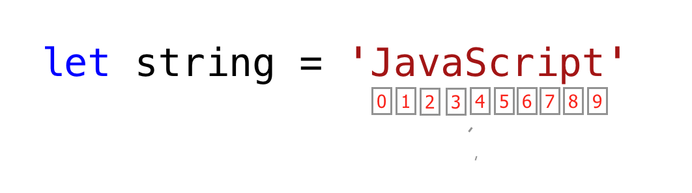

# 📔 Hari 2 - Gaskeun Lanjut!

## Tipe Data

Di bagian sebelumnya, kita udah dikit nyinggung soal tipe data. Data atau nilai itu punya tipe data. Tipe data ngejelasin karakteristik dari data. Tipe data bisa dibagi jadi dua nih:

1. Tipe data primitif
2. Tipe data non-primitif (Referensi Objek)

### Tipe Data Primitif

Tipe data primitif dalam JavaScript meliputi:

 1. Numbers - Bilangan bulat, desimal
 2. Strings - Data apa pun dalam tanda kutip tunggal, ganda, atau backtick
 3. Booleans - nilai true atau false
 4. Null - nilai kosong atau tidak ada nilai
 5. Undefined - variabel yang dideklarasikan tanpa nilai
 6. Symbol - Nilai unik yang dapat dibuat oleh konstruktor Symbol

Tipe data non-primitif dalam JavaScript meliputi:

1. Objects
2. Arrays

Sekarang, yuk kita lihat apa sih sebenernya arti tipe data primitif dan non-primitif.
Tipe data *Primitif* adalah tipe data yang immutable (nggak bisa dimodifikasi). Begitu tipe data primitif dibuat, kita nggak bisa modifikasi lagi.

**Contoh:**

```js
let word = 'JavaScript'
```

Kalau kita nyoba modifikasi string yang tersimpan di variabel *word*, JavaScript seharusnya nampilin error. Setiap data di dalam tanda kutip tunggal, ganda, atau backtick adalah tipe data string.

```js
word[0] = 'Y'
```

Ekspresi ini nggak ngubah string yang tersimpan di variabel *word*. Jadi, bisa dibilang string itu nggak bisa dimodifikasi alias immutable.
Tipe data primitif dibandingin berdasarkan nilainya. Yuk kita bandingin nilai data yang beda-beda. Lihat contoh di bawah nih:

```js
let numOne = 3
let numTwo = 3

console.log(numOne == numTwo)      // true

let js = 'JavaScript'
let py = 'Python'

console.log(js == py)             //false 

let lightOn = true
let lightOff = false

console.log(lightOn == lightOff) // false
```

### Tipe Data Non-Primitif

Tipe data *Non-primitif* bisa dimodifikasi alias mutable. Kita bisa modifikasi nilai tipe data non-primitif setelah dibuat.
Yuk kita lihat dengan bikin sebuah array. Array itu daftar nilai data dalam tanda kurung siku. Array bisa berisi tipe data yang sama atau beda-beda. Nilai array diakses berdasarkan indeksnya. Di JavaScript, indeks array dimulai dari nol. Artinya, elemen pertama array ada di indeks nol, elemen kedua di indeks satu, elemen ketiga di indeks dua, dan seterusnya.

```js
let nums = [1, 2, 3]
nums[0] = 10

console.log(nums)  // [10, 2, 3]
```

Nah, kayak yang kamu lihat, array yang merupakan tipe data non-primitif bersifat mutable. Tipe data non-primitif nggak bisa dibandingin berdasarkan nilai. Meskipun dua tipe data non-primitif punya properti dan nilai yang sama, mereka nggak strictly equal.

```js
let nums = [1, 2, 3]
let numbers = [1, 2, 3]

console.log(nums == numbers)  // false

let userOne = {
name:'Asabeneh',
role:'teaching',
country:'Finland'
}

let userTwo = {
name:'Asabeneh',
role:'teaching',
country:'Finland'
}

console.log(userOne == userTwo) // false
```

Aturan praktisnya, kita nggak membandingin tipe data non-primitif. Jangan bandingin array, fungsi, atau objek ya!
Nilai non-primitif disebut tipe referensi, karena mereka dibandingin berdasarkan referensi, bukan nilai. Dua objek cuma strictly equal kalau mereka merujuk ke objek dasar yang sama.

```js
let nums = [1, 2, 3]
let numbers = nums

console.log(nums == numbers)  // true

let userOne = {
name:'Asabeneh',
role:'teaching',
country:'Finland'
}

let userTwo = userOne

console.log(userOne == userTwo)  // true
```

Kalau kamu masih agak bingung bedain tipe data primitif dan non-primitif, santuy aja, kamu nggak sendirian kok. Tenang dan lanjut aja ke bagian berikutnya, nanti coba lagi setelah beberapa waktu. Sekarang yuk kita mulai tipe data dengan tipe number!

## Numbers

Numbers adalah bilangan bulat dan nilai desimal yang bisa ngelakuin semua operasi aritmatika.
Yuk lihat beberapa contoh Numbers.

### Mendeklarasikan Tipe Data Number

```js
let age = 35
const gravity = 9.81  // kita gunakan const untuk nilai yang tidak berubah, konstanta gravitasi dalam m/s2
let mass = 72         // massa dalam Kilogram
const PI = 3.14       // pi, konstanta geometris

// Contoh Lainnya
const boilingPoint = 100 // suhu dalam oC, titik didih air yang merupakan konstanta
const bodyTemp = 37      // oC suhu rata-rata tubuh manusia, yang merupakan konstanta

console.log(age, gravity, mass, PI, boilingPoint, bodyTemp)
```

### Math Object

Di JavaScript, Math Object nyediain banyak metode buat bekerja dengan angka. Mantap kan?

```js
const PI = Math.PI

console.log(PI)                            // 3.141592653589793

// Pembulatan ke angka terdekat
// jika di atas .5 naik, jika kurang dari 0.5 turun

console.log(Math.round(PI))                // 3 untuk membulatkan nilai ke angka terdekat

console.log(Math.round(9.81))              // 10

console.log(Math.floor(PI))                // 3 pembulatan ke bawah

console.log(Math.ceil(PI))                 // 4 pembulatan ke atas

console.log(Math.min(-5, 3, 20, 4, 5, 10)) // -5, mengembalikan nilai minimum

console.log(Math.max(-5, 3, 20, 4, 5, 10)) // 20, mengembalikan nilai maksimum

const randNum = Math.random() // membuat angka acak antara 0 hingga 0.999999
console.log(randNum)

// Mari kita buat angka acak antara 0 hingga 10

const num = Math.floor(Math.random () * 11) // membuat angka acak antara 0 dan 10
console.log(num)

//Nilai absolut
console.log(Math.abs(-10))      // 10

//Akar kuadrat
console.log(Math.sqrt(100))     // 10

console.log(Math.sqrt(2))       // 1.4142135623730951

// Pangkat
console.log(Math.pow(3, 2))     // 9

console.log(Math.E)             // 2.718

// Logaritma
// Mengembalikan logaritma natural dengan basis E dari x, Math.log(x)
console.log(Math.log(2))        // 0.6931471805599453
console.log(Math.log(10))       // 2.302585092994046

// Mengembalikan logaritma natural dari 2 dan 10 secara berturut-turut
console.log(Math.LN2)           // 0.6931471805599453
console.log(Math.LN10)          // 2.302585092994046

// Trigonometri
Math.sin(0)
Math.sin(60)

Math.cos(0)
Math.cos(60)
```

#### Generator Angka Acak

JavaScript Math Object punya metode random() buat ngehasilin angka acak dari 0 sampai 0.999999999... Seru kan?

```js
let randomNum = Math.random() // menghasilkan 0 hingga 0.999...
```

Sekarang, yuk kita lihat gimana kita bisa pake metode random() buat ngehasilin angka acak antara 0 dan 10:

```js
let randomNum = Math.random()         // menghasilkan 0 hingga 0.999
let numBtnZeroAndTen = randomNum * 11

console.log(numBtnZeroAndTen)         // ini menghasilkan: min 0 dan max 10.99

let randomNumRoundToFloor = Math.floor(numBtnZeroAndTen)
console.log(randomNumRoundToFloor)    // ini menghasilkan antara 0 dan 10
```

## Strings

Strings itu teks, yang ada di bawah tanda kutip **_tunggal_** , **_ganda_**, **_back-tick_**. Buat mendeklarasikan string, kita perlu nama variabel, operator assignment, dan nilai dalam tanda kutip tunggal, ganda, atau backtick.
Yuk lihat beberapa contoh string:

```js
let space = ' '           // string spasi kosong
let firstName = 'Asabeneh'
let lastName = 'Yetayeh'
let country = 'Finland'
let city = 'Helsinki'
let language = 'JavaScript'
let job = 'teacher'
let quote = "The saying,'Seeing is Believing' is not correct in 2020."
let quotWithBackTick = `The saying,'Seeing is Believing' is not correct in 2020.`
```

### Penggabungan String (String Concatenation)

Ngehubungin dua atau lebih string bareng-bareng disebut concatenation.
Pake string yang udah dideklarasikan di bagian String sebelumnya:

```js
let fullName = firstName + space + lastName; // concatenation, menggabungkan dua string.
console.log(fullName);
```

```sh
Asabeneh Yetayeh
```

Kita bisa gabungin string dengan berbagai cara.

#### Menggabungkan Menggunakan Operator Penjumlahan

Gabungin pake operator penjumlahan itu cara lama. Cara ini cukup melelahkan dan gampang error. Penting sih buat tahu cara ini, tapi gue saranin banget pake template string ES6 (nanti dijelasin ya).

```js
// Mendeklarasikan variabel berbeda dengan tipe data berbeda
let space = ' '
let firstName = 'Asabeneh'
let lastName = 'Yetayeh'
let country = 'Finland'
let city = 'Helsinki'
let language = 'JavaScript'
let job = 'teacher'
let age = 250


let fullName =firstName + space + lastName
let personInfoOne = fullName + '. I am ' + age + '. I live in ' + country; // penambahan string ES5

console.log(personInfoOne)
```

```sh
Asabeneh Yetayeh. I am 250. I live in Finland
```

#### String Literal Panjang

Sebuah string bisa berupa satu karakter, paragraf, atau satu halaman penuh. Kalau panjang string terlalu gede, dia nggak muat dalam satu baris. Kita bisa pake karakter backslash (\\) di akhir setiap baris buat nunjukin kalau stringnya bakal lanjut di baris berikutnya.
**Contoh:**

```js
const paragraph = "My name is Asabeneh Yetayeh. I live in Finland, Helsinki.\
I am a teacher and I love teaching. I teach HTML, CSS, JavaScript, React, Redux, \
Node.js, Python, Data Analysis and D3.js for anyone who is interested to learn. \
In the end of 2019, I was thinking to expand my teaching and to reach \
to global audience and I started a Python challenge from November 20 - December 19.\
It was one of the most rewarding and inspiring experience.\
Now, we are in 2020. I am enjoying preparing the 30DaysOfJavaScript challenge and \
I hope you are enjoying too."

console.log(paragraph)
```

#### Escape Sequences dalam String

Di JavaScript dan bahasa pemrograman lainnya, \ diikuti oleh beberapa karakter adalah escape sequence. Yuk kita lihat karakter escape yang paling umum:

- \n: baris baru
- \t: Tab, berarti 8 spasi
- \\\\: Back slash
- \\': Kutip tunggal (')
- \\": Kutip ganda (")
  
```js
console.log('I hope everyone is enjoying the 30 Days Of JavaScript challenge.\nDo you ?') // line break
console.log('Days\tTopics\tExercises')
console.log('Day 1\t3\t5')
console.log('Day 2\t3\t5')
console.log('Day 3\t3\t5')
console.log('Day 4\t3\t5')
console.log('This is a backslash  symbol (\\)') // Untuk menulis backslash
console.log('In every programming language it starts with \"Hello, World!\"')
console.log("In every programming language it starts with \'Hello, World!\'")
console.log('The saying \'Seeing is Believing\' isn\'t correct in 2020')
```

Output di konsol:

```sh
I hope everyone is enjoying the 30 Days Of JavaScript challenge.
Do you ?
Days  Topics  Exercises
Day 1 3 5
Day 2 3 5
Day 3 3 5
Day 4 3 5
This is a backslash  symbol (\)
In every programming language it starts with "Hello, World!"
In every programming language it starts with 'Hello, World!'
The saying 'Seeing is Believing' isn't correct in 2020
```

#### Template Literals (Template Strings)

Buat bikin template string, kita pake dua back-tick. Kita bisa nyuntikin data sebagai ekspresi di dalam template string. Buat nyuntikin data, kita bungkus ekspresi dengan kurung kurawal ({}) yang didahului tanda $. Lihat sintaks di bawah nih:

```js
//Sintaks
`String literal text`
`String literal text ${expression}`
```

**Contoh: 1**

```js
console.log(`The sum of 2 and 3 is 5`)              // menulis data secara statis
let a = 2
let b = 3
console.log(`The sum of ${a} and ${b} is ${a + b}`) // menyuntikkan data secara dinamis
```

**Contoh:2**

```js
let firstName = 'Asabeneh'
let lastName = 'Yetayeh'
let country = 'Finland'
let city = 'Helsinki'
let language = 'JavaScript'
let job = 'teacher'
let age = 250
let fullName = firstName + ' ' + lastName

let personInfoTwo = `I am ${fullName}. I am ${age}. I live in ${country}.` //ES6 - Metode interpolasi string
let personInfoThree = `I am ${fullName}. I live in ${city}, ${country}. I am a ${job}. I teach ${language}.`
console.log(personInfoTwo)
console.log(personInfoThree)
```

```sh
I am Asabeneh Yetayeh. I am 250. I live in Finland.
I am Asabeneh Yetayeh. I live in Helsinki, Finland. I am a teacher. I teach JavaScript.
```

Dengan pake template string atau metode interpolasi string, kita bisa nambahin ekspresi, yang bisa berupa nilai, atau beberapa operasi (perbandingan, operasi aritmatika, operasi ternary). Cakep kan?

```js
let a = 2
let b = 3
console.log(`${a} is greater than ${b}: ${a > b}`)
```

```sh
2 is greater than 3: false
```

### Metode String

Segala sesuatu di JavaScript itu objek. String adalah tipe data primitif yang artinya kita nggak bisa modifikasi setelah dibuat. Objek string punya banyak metode string. Ada berbagai metode string yang bisa bantu kita bekerja dengan string.

1. *length*: Metode string *length* ngembaliin jumlah karakter dalam sebuah string termasuk spasi kosong.

**Contoh:**

```js
let js = 'JavaScript'
console.log(js.length)         // 10
let firstName = 'Asabeneh'
console.log(firstName.length)  // 8
```

2. *Mengakses karakter dalam string*: Kita bisa akses setiap karakter dalam string pake indeksnya. Di pemrograman, penghitungan dimulai dari 0. Indeks pertama string adalah nol, dan indeks terakhir adalah panjang string dikurangi satu.

  
  
Yuk kita akses karakter yang beda-beda dalam string 'JavaScript'.

```js
let string = 'JavaScript'
let firstLetter = string[0]

console.log(firstLetter)           // J

let secondLetter = string[1]       // a
let thirdLetter = string[2]
let lastLetter = string[9]

console.log(lastLetter)            // t

let lastIndex = string.length - 1

console.log(lastIndex)  // 9
console.log(string[lastIndex])    // t
```

3. *toUpperCase()*: metode ini ngubah string jadi huruf besar semua.

```js
let string = 'JavaScript'

console.log(string.toUpperCase())     // JAVASCRIPT

let firstName = 'Asabeneh'

console.log(firstName.toUpperCase())  // ASABENEH

let country = 'Finland'

console.log(country.toUpperCase())    // FINLAND
```

4. *toLowerCase()*: metode ini ngubah string jadi huruf kecil semua.

```js
let string = 'JavasCript'

console.log(string.toLowerCase())     // javascript

let firstName = 'Asabeneh'

console.log(firstName.toLowerCase())  // asabeneh

let country = 'Finland'

console.log(country.toLowerCase())   // finland
```

5. *substr()*: Nerima dua argumen, indeks awal dan jumlah karakter yang mau dipotong.

```js
let string = 'JavaScript'
console.log(string.substr(4,6))    // Script

let country = 'Finland'
console.log(country.substr(3, 4))   // land
```

6. *substring()*: Nerima dua argumen, indeks awal dan indeks akhir tapi nggak nyertakan karakter di indeks akhir.

```js
let string = 'JavaScript'

console.log(string.substring(0,4))     // Java
console.log(string.substring(4,10))    // Script
console.log(string.substring(4))       // Script

let country = 'Finland'

console.log(country.substring(0, 3))   // Fin
console.log(country.substring(3, 7))   // land
console.log(country.substring(3))      // land
```

7. *split()*: Metode split ngebelah string di tempat yang ditentuin.

```js
let string = '30 Days Of JavaScript'

console.log(string.split())     // Berubah menjadi array -> ["30 Days Of JavaScript"]
console.log(string.split(' '))  // Dipecah menjadi array pada spasi -> ["30", "Days", "Of", "JavaScript"]

let firstName = 'Asabeneh'

console.log(firstName.split())    // Berubah menjadi array - > ["Asabeneh"]
console.log(firstName.split(''))  // Dipecah menjadi array pada setiap huruf ->  ["A", "s", "a", "b", "e", "n", "e", "h"]

let countries = 'Finland, Sweden, Norway, Denmark, and Iceland'

console.log(countries.split(','))  // dipecah menjadi array pada koma -> ["Finland", " Sweden", " Norway", " Denmark", " and Iceland"]
console.log(countries.split(', ')) //  ["Finland", "Sweden", "Norway", "Denmark", "and Iceland"]
```

8. *trim()*: Nghapus spasi di awal atau akhir string.

```js
let string = '   30 Days Of JavaScript   '

console.log(string)
console.log(string.trim(' '))

let firstName = ' Asabeneh '

console.log(firstName)
console.log(firstName.trim())  // tetap menghapus spasi di awal dan akhir string
```

```sh
   30 Days Of JavasCript   
30 Days Of JavasCript
  Asabeneh 
Asabeneh
```

9. *includes()*: Nerima argumen substring dan ngecek apakah argumen substring ada di dalam string. *includes()* ngembaliin boolean. Kalau substring ada di string, dia ngembaliin true, kalau nggak ada ngembaliin false.

```js
let string = '30 Days Of JavaScript'

console.log(string.includes('Days'))     // true
console.log(string.includes('days'))     // false - ini case sensitive!
console.log(string.includes('Script'))   // true
console.log(string.includes('script'))   // false
console.log(string.includes('java'))     // false
console.log(string.includes('Java'))     // true

let country = 'Finland'

console.log(country.includes('fin'))     // false
console.log(country.includes('Fin'))     // true
console.log(country.includes('land'))    // true
console.log(country.includes('Land'))    // false
```

10. *replace()*: nerima sebagai parameter substring lama dan substring baru.

```js
string.replace(oldsubstring, newsubstring)
```

```js
let string = '30 Days Of JavaScript'
console.log(string.replace('JavaScript', 'Python')) // 30 Days Of Python

let country = 'Finland'
console.log(country.replace('Fin', 'Noman'))       // Nomanland
```

11. *charAt()*: Nerima indeks dan ngembaliin nilai di indeks tersebut.

```js
string.charAt(index)
```

```js
let string = '30 Days Of JavaScript'
console.log(string.charAt(0))        // 3

let lastIndex = string.length - 1
console.log(string.charAt(lastIndex)) // t
```

12. *charCodeAt()*: Nerima indeks dan ngembaliin kode char (nomor ASCII) dari nilai di indeks tersebut.

```js
string.charCodeAt(index)
```

```js
let string = '30 Days Of JavaScript'
console.log(string.charCodeAt(3))        // Nomor ASCII D adalah 68

let lastIndex = string.length - 1
console.log(string.charCodeAt(lastIndex)) // ASCII t adalah 116

```

13. *indexOf()*: Nerima substring dan kalau substring ada di string, dia ngembaliin posisi pertama substring, kalau nggak ada ngembaliin -1.

```js
string.indexOf(substring)
```

```js
let string = '30 Days Of JavaScript'

console.log(string.indexOf('D'))          // 3
console.log(string.indexOf('Days'))       // 3
console.log(string.indexOf('days'))       // -1
console.log(string.indexOf('a'))          // 4
console.log(string.indexOf('JavaScript')) // 11
console.log(string.indexOf('Script'))     //15
console.log(string.indexOf('script'))     // -1
```

14. *lastIndexOf()*: Nerima substring dan kalau substring ada di string, dia ngembaliin posisi terakhir substring, kalau nggak ada ngembaliin -1.


```js
//sintaks
string.lastIndexOf(substring)
```

```js
let string = 'I love JavaScript. If you do not love JavaScript what else can you love.'

console.log(string.lastIndexOf('love'))       // 67
console.log(string.lastIndexOf('you'))        // 63
console.log(string.lastIndexOf('JavaScript')) // 38
```

15. *concat()*: nerima banyak substring dan ngegabungin mereka.

```js
string.concat(substring, substring, substring)
```

```js
let string = '30'
console.log(string.concat("Days", "Of", "JavaScript")) // 30DaysOfJavaScript

let country = 'Fin'
console.log(country.concat("land")) // Finland
```

16. *startsWith*: nerima substring sebagai argumen dan ngecek apakah string dimulai dengan substring yang ditentuin. Ngembaliin boolean (true atau false).

```js
//sintaks
string.startsWith(substring)
```

```js
let string = 'Love is the best to in this world'

console.log(string.startsWith('Love'))   // true
console.log(string.startsWith('love'))   // false
console.log(string.startsWith('world'))  // false

let country = 'Finland'

console.log(country.startsWith('Fin'))   // true
console.log(country.startsWith('fin'))   // false
console.log(country.startsWith('land'))  //  false
```

17. *endsWith*: nerima substring sebagai argumen dan ngecek apakah string diakhiri dengan substring yang ditentuin. Ngembaliin boolean (true atau false).

```js
string.endsWith(substring)
```

```js
let string = 'Love is the most powerful feeling in the world'

console.log(string.endsWith('world'))         // true
console.log(string.endsWith('love'))          // false
console.log(string.endsWith('in the world')) // true

let country = 'Finland'

console.log(country.endsWith('land'))         // true
console.log(country.endsWith('fin'))          // false
console.log(country.endsWith('Fin'))          //  false
```

18. *search*: nerima substring sebagai argumen dan ngembaliin indeks dari kecocokan pertama. Nilai pencarian bisa berupa string atau pola regular expression.

```js
string.search(substring)
```

```js
let string = 'I love JavaScript. If you do not love JavaScript what else can you love.'
console.log(string.search('love'))          // 2
console.log(string.search(/javascript/gi))  // 7
```

19. *match*: nerima substring atau pola regular expression sebagai argumen dan ngembaliin array kalau ada kecocokan, kalau nggak ada ngembaliin null. Yuk kita lihat gimana pola regular expression keliatannya. Dimulai dengan tanda / dan diakhiri dengan tanda /.

```js
let string = 'love'
let patternOne = /love/     // tanpa flag
let patternTwo = /love/gi   // g-berarti mencari di seluruh teks, i - case insensitive
```

Sintaks Match

```js
// sintaks
string.match(substring)
```

```js
let string = 'I love JavaScript. If you do not love JavaScript what else can you love.'
console.log(string.match('love'))
```

```sh
["love", index: 2, input: "I love JavaScript. If you do not love JavaScript what else can you love.", groups: undefined]
```

```js
let pattern = /love/gi
console.log(string.match(pattern))   // ["love", "love", "love"]
```

Yuk kita ekstrak angka dari teks pake regular expression. Ini bukan bagian regular expression, jangan panik dulu! Kita bakal bahas regular expression nanti.

```js
let txt = 'In 2019, I ran 30 Days of Python. Now, in 2020 I am super exited to start this challenge'
let regEx = /\d+/

// d dengan karakter escape berarti d bukan d biasa melainkan bertindak sebagai digit
// + berarti satu atau lebih digit angka,
// jika ada g setelahnya berarti global, cari di mana-mana.

console.log(txt.match(regEx))  // ["2", "0", "1", "9", "3", "0", "2", "0", "2", "0"]
console.log(txt.match(/\d+/g)) // ["2019", "30", "2020"]
```

20. *repeat()*: nerima angka sebagai argumen dan ngembaliin versi string yang diulang.

```js
string.repeat(n)
```

```js
let string = 'love'
console.log(string.repeat(10)) // lovelovelovelovelovelovelovelovelovelove
```

## Memeriksa Tipe Data dan Casting

### Memeriksa Tipe Data

Buat ngecek tipe data dari suatu variabel, kita pake metode _typeof_.

**Contoh:**

```js
// Berbagai tipe data javascript
// Mari deklarasikan berbagai tipe data

let firstName = 'Asabeneh'      // string
let lastName = 'Yetayeh'        // string
let country = 'Finland'         // string
let city = 'Helsinki'           // string
let age = 250                   // number, ini bukan usia saya yang sebenarnya, jangan khawatir
let job                         // undefined, karena nilai belum ditetapkan

console.log(typeof 'Asabeneh')  // string
console.log(typeof firstName)   // string
console.log(typeof 10)          // number
console.log(typeof 3.14)        // number
console.log(typeof true)        // boolean
console.log(typeof false)       // boolean
console.log(typeof NaN)         // number
console.log(typeof job)         // undefined
console.log(typeof undefined)   // undefined
console.log(typeof null)        // object
```

### Mengubah Tipe Data (Casting)

- Casting: Ngubah satu tipe data ke tipe data lainnya. Kita pake _parseInt()_, _parseFloat()_, _Number()_, _tanda +_, _str()_
  Ketika kita ngelakuin operasi aritmatika, string angka harus dikonversi dulu ke integer atau float, kalau nggak nanti error.

#### String ke Int

Kita bisa ngubah string angka jadi angka. Angka apa pun di dalam tanda kutip adalah string angka. Contoh string angka: '10', '5', dll.
Kita bisa ngubah string ke angka pake metode berikut:

- parseInt()
- Number()
- Tanda plus(+)

```js
let num = '10'
let numInt = parseInt(num)
console.log(numInt) // 10
```

```js
let num = '10'
let numInt = Number(num)

console.log(numInt) // 10
```

```js
let num = '10'
let numInt = +num

console.log(numInt) // 10
```

#### String ke Float

Kita bisa ngubah string float jadi float. Angka float apa pun di dalam tanda kutip adalah string float. Contoh string float: '9.81', '3.14', '1.44', dll.
Kita bisa ngubah string float ke angka pake metode berikut:

- parseFloat()
- Number()
- Tanda plus(+)

```js
let num = '9.81'
let numFloat = parseFloat(num)

console.log(numFloat) // 9.81
```

```js
let num = '9.81'
let numFloat = Number(num)

console.log(numFloat) // 9.81
```

```js
let num = '9.81'
let numFloat = +num

console.log(numFloat) // 9.81
```

#### Float ke Int

Kita bisa ngubah float jadi integer.
Kita pake metode berikut buat ngubah float ke int:

- parseInt()
  
```js
let num = 9.81
let numInt = parseInt(num)

console.log(numInt) // 9
```

🌕 Kamu luar biasa! Kamu baru aja nyelesein tantangan hari ke-2 dan kamu udah selangkah lebih maju menuju kehebatan. Gaskeun sekarang lakuin latihan buat otak dan otot kamu!  

## 💻 Hari 2: Latihan

### Latihan: Level 1

1. Deklarasikan variabel bernama challenge dan kasih nilai awal **'30 Days Of JavaScript'**.
2. Cetak string tersebut di konsol browser pake __console.log()__
3. Cetak __length__ dari string tersebut di konsol browser pake _console.log()_
4. Ubah semua karakter string jadi huruf kapital pake metode __toUpperCase()__
5. Ubah semua karakter string jadi huruf kecil pake metode __toLowerCase()___
6. Potong (slice) kata pertama dari string pake metode __substr()__ atau __substring()__
7. Potong frasa *Days Of JavaScript* dari *30 Days Of JavaScript*.
8. Cek apakah string mengandung kata __Script__ pake metode __includes()__
9. Pisahin __string__ jadi __array__ pake metode __split()__
10. Pisahin string 30 Days Of JavaScript pada spasi pake metode __split()__
11. 'Facebook, Google, Microsoft, Apple, IBM, Oracle, Amazon' __split__ string tersebut pada koma dan ubah jadi array.
12. Ubah 30 Days Of JavaScript jadi 30 Days Of Python pake metode __replace()__.
13. Karakter apa di indeks 15 dalam string '30 Days Of JavaScript'? Pake metode __charAt()__.
14. Berapa kode karakter dari J dalam string '30 Days Of JavaScript' pake __charCodeAt()__
15. Pake __indexOf__ buat nentuin posisi kemunculan pertama __a__ dalam 30 Days Of JavaScript
16. Pake __lastIndexOf__ buat nentuin posisi kemunculan terakhir __a__ dalam 30 Days Of JavaScript.
17. Pake __indexOf__ buat nemuin posisi kemunculan pertama kata __because__ dalam kalimat berikut:__'You cannot end a sentence with because because because is a conjunction'__
18. Pake __lastIndexOf__ buat nemuin posisi kemunculan terakhir kata __because__ dalam kalimat berikut:__'You cannot end a sentence with because because because is a conjunction'__
19. Pake __search__ buat nemuin posisi kemunculan pertama kata __because__ dalam kalimat berikut:__'You cannot end a sentence with because because because is a conjunction'__
20. Pake __trim()__ buat ngapus spasi di awal dan akhir string. Contoh ' 30 Days Of JavaScript '.
21. Pake metode __startsWith()__ dengan string *30 Days Of JavaScript* dan bikin hasilnya true
22. Pake metode __endsWith()__ dengan string *30 Days Of JavaScript* dan bikin hasilnya true
23. Pake metode __match()__ buat nemuin semua __a__ dalam 30 Days Of JavaScript
24. Pake __concat()__ dan gabungin '30 Days of' dan 'JavaScript' jadi satu string, '30 Days Of JavaScript'
25. Pake metode __repeat()__ buat nyetak 30 Days Of JavaScript sebanyak 2 kali

### Latihan: Level 2

1. Pake console.log() cetak pernyataan berikut:

    ```sh
    The quote 'There is no exercise better for the heart than reaching down and lifting people up.' by John Holmes teaches us to help one another.
    ```

2. Pake console.log() cetak kutipan berikut oleh Mother Teresa:

    ```sh
    "Love is not patronizing and charity isn't about pity, it is about love. Charity and love are the same -- with charity you give love, so don't just give money but reach out your hand instead."
    ```

3. Cek apakah typeof '10' persis sama dengan 10. Kalau nggak, bikin jadi persis sama.
4. Cek apakah parseFloat('9.8') sama dengan 10, kalau nggak bikin jadi persis sama dengan 10.
5. Cek apakah 'on' ditemuin di kedua kata python dan jargon
6. _I hope this course is not full of jargon_. Cek apakah _jargon_ ada di kalimat tersebut.
7. Hasilin angka acak antara 0 dan 100 secara inklusif.
8. Hasilin angka acak antara 50 dan 100 secara inklusif.
9. Hasilin angka acak antara 0 dan 255 secara inklusif.
10. Akses karakter string 'JavaScript' pake angka acak.
11. Pake console.log() dan escape characters buat nyetak pola berikut.

    ```js
    1 1 1 1 1
    2 1 2 4 8
    3 1 3 9 27
    4 1 4 16 64
    5 1 5 25 125
    ```

12. Pake __substr__ buat motong frasa __because because because__ dari kalimat berikut:__'You cannot end a sentence with because because because is a conjunction'__

### Latihan: Level 3

1. 'Love is the best thing in this world. Some found their love and some are still looking for their love.' Hitung jumlah kata __love__ di kalimat ini.
2. Pake __match()__ buat ngitung jumlah semua __because__ di kalimat berikut:__'You cannot end a sentence with because because because is a conjunction'__
3. Bersihin teks berikut dan temuin kata yang paling sering muncul (petunjuk, pake replace dan regular expressions).

    ```js
        const sentence = '%I $am@% a %tea@cher%, &and& I lo%#ve %te@a@ching%;. The@re $is no@th@ing; &as& mo@re rewarding as educa@ting &and& @emp%o@weri@ng peo@ple. ;I found tea@ching m%o@re interesting tha@n any ot#her %jo@bs. %Do@es thi%s mo@tiv#ate yo@u to be a tea@cher!? %Th#is 30#Days&OfJavaScript &is al@so $the $resu@lt of &love& of tea&ching'
    ```

4. Hitung total pendapatan tahunan orang tersebut dengan ngekstrak angka dari teks berikut. 'He earns 5000 euro from salary per month, 10000 euro annual bonus, 15000 euro online courses per month.'

🎉 SELAMAT ! 🎉
