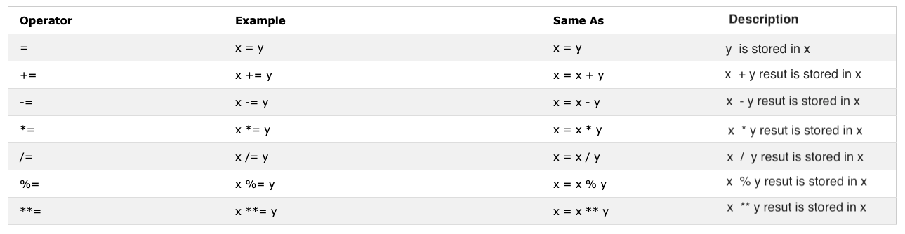
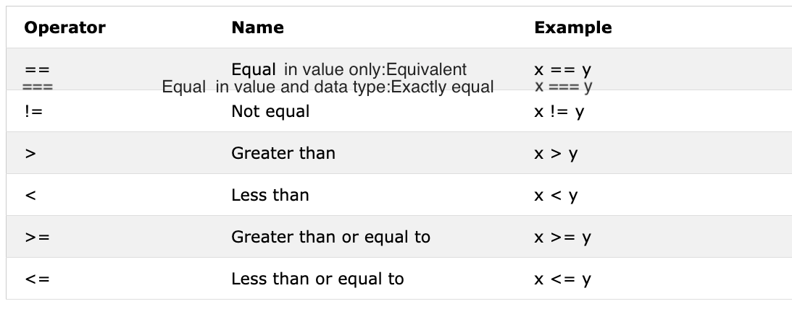
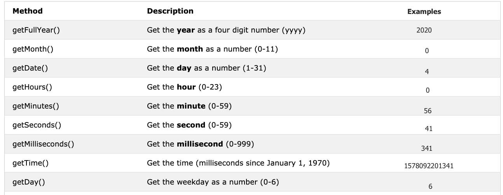

# 📔 Hari 3

## Booleans

Tipe data boolean merepresentasikan salah satu dari dua nilai: _true_ atau _false_. Nilai boolean adalah true atau false. Penggunaan tipe data ini akan menjadi jelas ketika Anda memulai operator perbandingan. Setiap perbandingan mengembalikan nilai boolean yaitu true atau false.

**Contoh: Nilai Boolean**

```js
let isLightOn = true
let isRaining = false
let isHungry = false
let isMarried = true
let truValue = 4 > 3    // true
let falseValue = 4 < 3  // false
```

Kita sepakat bahwa nilai boolean adalah true atau false.

### Nilai Truthy

- Semua angka (positif dan negatif) adalah truthy kecuali nol
- Semua string adalah truthy kecuali string kosong ('')
- Boolean true

### Nilai Falsy

- 0
- 0n
- null
- undefined
- NaN
- boolean false
- '', "", ``, string kosong

Penting untuk mengingat nilai truthy dan falsy tersebut. Di bagian selanjutnya, kita akan menggunakannya dengan kondisi untuk membuat keputusan.

## Undefined

Jika kita mendeklarasikan variabel dan tidak menetapkan nilai, nilainya akan menjadi undefined. Selain itu, jika sebuah fungsi tidak mengembalikan nilai, hasilnya akan undefined.

```js
let firstName
console.log(firstName) //tidak terdefinisi, karena belum diberi nilai
```

## Null

```js
let empty = null
console.log(empty) // -> null , berarti tidak ada nilai
```

## Operator

### Operator Assignment

Tanda sama dengan dalam JavaScript adalah operator assignment. Digunakan untuk menetapkan nilai ke variabel.

```js
let firstName = 'Asabeneh'
let country = 'Finland'
```

Operator Assignment



### Operator Aritmatika

Operator aritmatika adalah operator matematika.

- Penjumlahan(+): a + b
- Pengurangan(-): a - b
- Perkalian(*): a * b
- Pembagian(/): a / b
- Modulus(%): a % b
- Eksponensial(**): a ** b

```js
let numOne = 4
let numTwo = 3
let sum = numOne + numTwo
let diff = numOne - numTwo
let mult = numOne * numTwo
let div = numOne / numTwo
let remainder = numOne % numTwo
let powerOf = numOne ** numTwo

console.log(sum, diff, mult, div, remainder, powerOf) // 7,1,12,1.33,1, 64

```

```js
const PI = 3.14
let radius = 100          // panjang dalam meter

//Mari kita hitung luas lingkaran
const areaOfCircle = PI * radius * radius
console.log(areaOfCircle)  //  314 m


const gravity = 9.81      // dalam m/s2
let mass = 72             // dalam Kilogram

// Mari kita hitung berat suatu objek
const weight = mass * gravity
console.log(weight)        // 706.32 N(Newton)

const boilingPoint = 100  // suhu dalam oC, titik didih air
const bodyTemp = 37       // suhu tubuh dalam oC


// Menggabungkan string dengan angka menggunakan interpolasi string
/*
 Titik didih air adalah 100 oC.
 Suhu tubuh manusia adalah 37 oC.
 Gravitasi bumi adalah 9.81 m/s2.
 */
console.log(
  `The boiling point of water is ${boilingPoint} oC.\nHuman body temperature is ${bodyTemp} oC.\nThe gravity of earth is ${gravity} m / s2.`
)
```

### Operator Perbandingan

Dalam pemrograman kita membandingkan nilai, kita menggunakan operator perbandingan untuk membandingkan dua nilai. Kita memeriksa apakah suatu nilai lebih besar, lebih kecil, atau sama dengan nilai lainnya.


**Contoh: Operator Perbandingan**

```js
console.log(3 > 2)              // true, karena 3 lebih besar dari 2
console.log(3 >= 2)             // true, karena 3 lebih besar dari 2
console.log(3 < 2)              // false, karena 3 lebih besar dari 2
console.log(2 < 3)              // true, karena 2 lebih kecil dari 3
console.log(2 <= 3)             // true, karena 2 lebih kecil dari 3
console.log(3 == 2)             // false, karena 3 tidak sama dengan 2
console.log(3 != 2)             // true, karena 3 tidak sama dengan 2
console.log(3 == '3')           // true, hanya membandingkan nilai
console.log(3 === '3')          // false, membandingkan nilai dan tipe data
console.log(3 !== '3')          // true, membandingkan nilai dan tipe data
console.log(3 != 3)             // false, hanya membandingkan nilai
console.log(3 !== 3)            // false, membandingkan nilai dan tipe data
console.log(0 == false)         // true, ekuivalen
console.log(0 === false)        // false, tidak persis sama
console.log(0 == '')            // true, ekuivalen
console.log(0 == ' ')           // true, ekuivalen
console.log(0 === '')           // false, tidak persis sama
console.log(1 == true)          // true, ekuivalen
console.log(1 === true)         // false, tidak persis sama
console.log(undefined == null)  // true
console.log(undefined === null) // false
console.log(NaN == NaN)         // false, tidak sama
console.log(NaN === NaN)        // false
console.log(typeof NaN)         // number

console.log('mango'.length == 'avocado'.length)  // false
console.log('mango'.length != 'avocado'.length)  // true
console.log('mango'.length < 'avocado'.length)   // true
console.log('milk'.length == 'meat'.length)      // true
console.log('milk'.length != 'meat'.length)      // false
console.log('tomato'.length == 'potato'.length)  // true
console.log('python'.length > 'dragon'.length)   // false
```

Cobalah untuk memahami perbandingan di atas dengan sedikit logika. Mengingat tanpa logika mungkin sulit.
JavaScript bisa dibilang bahasa pemrograman yang agak aneh. Kode JavaScript berjalan dan memberi Anda hasil, tetapi kecuali Anda sudah mahir, hasilnya mungkin tidak seperti yang diinginkan.

Sebagai aturan praktis, jika suatu nilai tidak true dengan == maka tidak akan sama dengan ===. Menggunakan === lebih aman daripada menggunakan ==. [Tautan](https://dorey.github.io/JavaScript-Equality-Table/) berikut memiliki daftar lengkap perbandingan tipe data.

### Operator Logika

Simbol berikut adalah operator logika yang umum:
&& (ampersand), || (pipe) dan ! (negasi).
Operator && menghasilkan true hanya jika kedua operand bernilai true.
Operator || menghasilkan true jika salah satu operand bernilai true.
Operator ! meniadakan true menjadi false dan false menjadi true.

```js
// && contoh operator ampersand

const check = 4 > 3 && 10 > 5         // true && true -> true
const check = 4 > 3 && 10 < 5         // true && false -> false
const check = 4 < 3 && 10 < 5         // false && false -> false

// || pipe atau operator, contoh

const check = 4 > 3 || 10 > 5         // true  || true -> true
const check = 4 > 3 || 10 < 5         // true  || false -> true
const check = 4 < 3 || 10 < 5         // false || false -> false

//! Contoh negasi

let check = 4 > 3                     // true
let check = !(4 > 3)                  //  false
let isLightOn = true
let isLightOff = !isLightOn           // false
let isMarried = !false                // true
```

### Operator Increment

Dalam JavaScript kita menggunakan operator increment untuk menambah nilai yang tersimpan dalam variabel. Increment bisa berupa pre atau post increment. Mari kita lihat masing-masing:

1. Pre-increment

```js
let count = 0
console.log(++count)        // 1
console.log(count)          // 1
```

1. Post-increment

```js
let count = 0
console.log(count++)        // 0
console.log(count)          // 1
```

Kita lebih sering menggunakan post-increment. Setidaknya Anda harus ingat cara menggunakan operator post-increment.

### Operator Decrement

Dalam JavaScript kita menggunakan operator decrement untuk mengurangi nilai yang tersimpan dalam variabel. Decrement bisa berupa pre atau post decrement. Mari kita lihat masing-masing:

1. Pre-decrement

```js
let count = 0
console.log(--count) // -1
console.log(count)  // -1
```

2. Post-decrement

```js
let count = 0
console.log(count--) // 0
console.log(count)   // -1
```

### Operator Ternary

Operator ternary memungkinkan untuk menulis kondisi.
Cara lain untuk menulis kondisional adalah menggunakan operator ternary. Lihat contoh berikut:

```js
let isRaining = true
isRaining
  ? console.log('You need a rain coat.')
  : console.log('No need for a rain coat.')
isRaining = false

isRaining
  ? console.log('You need a rain coat.')
  : console.log('No need for a rain coat.')
```

```sh
You need a rain coat.
No need for a rain coat.
```

```js
let number = 5
number > 0
  ? console.log(`${number} is a positive number`)
  : console.log(`${number} is a negative number`)
number = -5

number > 0
  ? console.log(`${number} is a positive number`)
  : console.log(`${number} is a negative number`)
```

```sh
5 is a positive number
-5 is a negative number
```

### Prioritas Operator

Saya sarankan Anda untuk membaca tentang prioritas operator dari [tautan](https://developer.mozilla.org/en-US/docs/Web/JavaScript/Reference/Operators/Operator_Precedence) ini.

## Metode Window

### Metode Window alert()

Seperti yang telah Anda lihat di awal, metode alert() menampilkan kotak peringatan dengan pesan tertentu dan tombol OK. Ini adalah metode bawaan dan menerima satu argumen.

```js
alert(message)
```

```js
alert('Welcome to 30DaysOfJavaScript')
```

Jangan terlalu sering menggunakan alert karena mengganggu dan menjengkelkan, gunakan hanya untuk menguji.

### Metode Window prompt()

Metode window prompt menampilkan kotak prompt dengan input di browser Anda untuk mengambil nilai input dan data input dapat disimpan dalam variabel. Metode prompt() menerima dua argumen. Argumen kedua bersifat opsional.

```js
prompt('required text', 'optional text')
```

```js
let number = prompt('Enter number', 'number goes here')
console.log(number)
```

### Metode Window confirm()

Metode confirm() menampilkan kotak dialog dengan pesan tertentu, bersama dengan tombol OK dan Cancel.
Kotak konfirmasi sering digunakan untuk meminta izin dari pengguna untuk menjalankan sesuatu. Window confirm() menerima string sebagai argumen.
Mengklik OK menghasilkan nilai true, sedangkan mengklik tombol Cancel menghasilkan nilai false.

```js
const agree = confirm('Are you sure you like to delete? ')
console.log(agree) // hasilnya akan true atau false berdasarkan apa yang Anda klik pada kotak dialog
```

Ini bukan semua metode window, kita akan memiliki bagian terpisah untuk mendalami metode window.

## Date Object

Waktu adalah hal yang penting. Kita ingin mengetahui waktu suatu aktivitas atau peristiwa tertentu. Dalam JavaScript, waktu dan tanggal saat ini dibuat menggunakan JavaScript Date Object. Objek yang kita buat menggunakan Date object menyediakan banyak metode untuk bekerja dengan tanggal dan waktu. Metode yang kita gunakan untuk mendapatkan informasi tanggal dan waktu dari nilai date object dimulai dengan kata _get_ karena memberikan informasi.
_getFullYear(), getMonth(), getDate(), getDay(), getHours(), getMinutes, getSeconds(), getMilliseconds(), getTime(), getDay()_



### Membuat objek waktu

Setelah kita membuat objek waktu. Objek waktu akan memberikan informasi tentang waktu. Mari kita buat objek waktu.

```js
const now = new Date()
console.log(now) // Sat Jan 04 2020 00:56:41 GMT+0200 (Eastern European Standard Time)
```

Kita telah membuat objek waktu dan kita dapat mengakses informasi tanggal waktu apa pun dari objek menggunakan metode get yang telah kita sebutkan di tabel.

### Mendapatkan tahun penuh

Mari kita ekstrak atau dapatkan tahun penuh dari objek waktu.

```js
const now = new Date()
console.log(now.getFullYear()) // 2020
```

### Mendapatkan bulan

Mari kita ekstrak atau dapatkan bulan dari objek waktu.

```js
const now = new Date()
console.log(now.getMonth()) // 0, karena bulannya adalah Januari, bulan(0-11)
```

### Mendapatkan tanggal

Mari kita ekstrak atau dapatkan tanggal dari objek waktu.

```js
const now = new Date()
console.log(now.getDate()) // 4, karena tanggalnya adalah 4, tanggal(1-31)
```

### Mendapatkan hari

Mari kita ekstrak atau dapatkan hari dalam seminggu dari objek waktu.

```js
const now = new Date()
console.log(now.getDay()) // 6, karena harinya adalah Sabtu yang merupakan hari ke-7
//  Minggu adalah 0, Senin adalah 1 dan Sabtu adalah 6
// Mendapatkan hari dalam seminggu sebagai angka (0-6)
```

### Mendapatkan jam

Mari kita ekstrak atau dapatkan jam dari objek waktu.

```js
const now = new Date()
console.log(now.getHours()) // 0, karena waktunya adalah 00:56:41
```

### Mendapatkan menit

Mari kita ekstrak atau dapatkan menit dari objek waktu.

```js
const now = new Date()
console.log(now.getMinutes()) // 56, karena waktunya adalah 00:56:41
```

### Mendapatkan detik

Mari kita ekstrak atau dapatkan detik dari objek waktu.

```js
const now = new Date()
console.log(now.getSeconds()) // 41, karena waktunya adalah 00:56:41
```

### Mendapatkan waktu

Metode ini memberikan waktu dalam milidetik mulai dari 1 Januari 1970. Ini juga dikenal sebagai waktu Unix. Kita bisa mendapatkan unix time dengan dua cara:

1. Menggunakan _getTime()_

```js
const now = new Date() //
console.log(now.getTime()) // 1578092201341, ini adalah jumlah detik yang berlalu dari 1 Januari 1970 hingga 4 Januari 2020 00:56:41
```

1. Menggunakan _Date.now()_

```js
const allSeconds = Date.now() //
console.log(allSeconds) // 1578092201341, ini adalah jumlah detik yang berlalu dari 1 Januari 1970 hingga 4 Januari 2020 00:56:41

const timeInSeconds = new Date().getTime()
console.log(allSeconds == timeInSeconds) // true
```

Mari kita format nilai-nilai ini ke format waktu yang dapat dibaca manusia.
**Contoh:**

```js
const now = new Date()
const year = now.getFullYear() // mengembalikan tahun
const month = now.getMonth() + 1 // mengembalikan bulan(0 - 11)
const date = now.getDate() // mengembalikan tanggal (1 - 31)
const hours = now.getHours() // mengembalikan angka (0 - 23)
const minutes = now.getMinutes() // mengembalikan angka (0 -59)

console.log(`${date}/${month}/${year} ${hours}:${minutes}`) // 4/1/2020 0:56
```

🌕 Anda memiliki energi tanpa batas. Anda baru saja menyelesaikan tantangan hari ke-3 dan Anda selangkah lebih maju menuju kehebatan. Sekarang lakukan beberapa latihan untuk otak dan otot Anda.

## 💻 Hari 3: Latihan

### Latihan: Level 1

1. Deklarasikan variabel firstName, lastName, country, city, age, isMarried, year dan berikan nilai padanya, lalu gunakan operator typeof untuk memeriksa tipe data yang berbeda.
2. Periksa apakah tipe dari '10' sama dengan 10
3. Periksa apakah parseInt('9.8') sama dengan 10
4. Nilai boolean adalah true atau false.
   1. Tulis tiga pernyataan JavaScript yang memberikan nilai truthy.
   2. Tulis tiga pernyataan JavaScript yang memberikan nilai falsy.

5. Cari tahu hasil dari ekspresi perbandingan berikut terlebih dahulu tanpa menggunakan console.log(). Setelah Anda memutuskan hasilnya, konfirmasikan menggunakan console.log()
   1. 4 > 3
   2. 4 >= 3
   3. 4 < 3
   4. 4 <= 3
   5. 4 == 4
   6. 4 === 4
   7. 4 != 4
   8. 4 !== 4
   9. 4 != '4'
   10. 4 == '4'
   11. 4 === '4'
   12. Temukan panjang python dan jargon dan buat pernyataan perbandingan falsy.

6. Cari tahu hasil dari ekspresi berikut terlebih dahulu tanpa menggunakan console.log(). Setelah Anda memutuskan hasilnya, konfirmasikan menggunakan console.log()
   1. 4 > 3 && 10 < 12
   2. 4 > 3 && 10 > 12
   3. 4 > 3 || 10 < 12
   4. 4 > 3 || 10 > 12
   5. !(4 > 3)
   6. !(4 < 3)
   7. !(false)
   8. !(4 > 3 && 10 < 12)
   9. !(4 > 3 && 10 > 12)
   10. !(4 === '4')
   11. Tidak ada 'on' di kedua kata dragon dan python

7. Gunakan Date object untuk melakukan aktivitas berikut
   1. Berapa tahun hari ini?
   2. Berapa bulan hari ini sebagai angka?
   3. Berapa tanggal hari ini?
   4. Berapa hari hari ini sebagai angka?
   5. Berapa jam sekarang?
   6. Berapa menit sekarang?
   7. Temukan jumlah detik yang telah berlalu dari 1 Januari 1970 hingga sekarang.

### Latihan: Level 2

1. Tulis script yang meminta pengguna memasukkan alas dan tinggi segitiga dan menghitung luas segitiga (luas = 0.5 x a x t).

   ```sh
   Masukkan alas: 20
   Masukkan tinggi: 10
   Luas segitiga adalah 100
   ```

1. Tulis script yang meminta pengguna memasukkan sisi a, sisi b, dan sisi c segitiga dan menghitung keliling segitiga (keliling = a + b + c)

   ```sh
   Masukkan sisi a: 5
   Masukkan sisi b: 4
   Masukkan sisi c: 3
   Keliling segitiga adalah 12
   ```

1. Dapatkan panjang dan lebar menggunakan prompt dan hitung luas persegi panjang (luas = panjang x lebar) dan keliling persegi panjang (keliling = 2 x (panjang + lebar))
1. Dapatkan jari-jari menggunakan prompt dan hitung luas lingkaran (luas = pi x r x r) dan keliling lingkaran (k = 2 x pi x r) di mana pi = 3.14.
1. Hitung kemiringan (slope), perpotongan sumbu x (x-intercept) dan perpotongan sumbu y (y-intercept) dari y = 2x -2
1. Kemiringan adalah m = (y<sub>2</sub>-y<sub>1</sub>)/(x<sub>2</sub>-x<sub>1</sub>). Temukan kemiringan antara titik (2, 2) dan titik (6,10)
1. Bandingkan kemiringan dari dua pertanyaan di atas.
1. Hitung nilai y (y = x<sup>2</sup> + 6x + 9). Coba gunakan nilai x yang berbeda dan cari tahu pada nilai x berapa y adalah 0.
1. Tulis script yang meminta pengguna memasukkan jam dan tarif per jam. Hitung gaji orang tersebut?

    ```sh
    Masukkan jam: 40
    Masukkan tarif per jam: 28
    Penghasilan mingguan Anda adalah 1120
    ```

1. Jika panjang nama Anda lebih dari 7, katakan nama Anda panjang, jika tidak katakan nama Anda pendek.
1. Bandingkan panjang nama depan dan nama keluarga Anda, dan Anda harus mendapatkan output ini.

    ```js
    let firstName = 'Asabeneh'
    let lastName = 'Yetayeh'
    ```

    ```sh
    Nama depan Anda, Asabeneh lebih panjang dari nama keluarga Anda, Yetayeh
    ```

1. Deklarasikan dua variabel _myAge_ dan _yourAge_ dan berikan nilai awal myAge dan yourAge.

   ```js
   let myAge = 250
   let yourAge = 25
   ```

   ```sh
   Saya 225 tahun lebih tua dari Anda.
   ```

1. Menggunakan prompt dapatkan tahun lahir pengguna dan jika pengguna berusia 18 tahun ke atas, izinkan pengguna untuk mengemudi, jika tidak beri tahu pengguna untuk menunggu sejumlah tahun tertentu.

    ```sh

    Masukkan tahun lahir: 1995
    Anda berusia 25. Anda cukup umur untuk mengemudi

    Masukkan tahun lahir: 2005
    Anda berusia 15. Anda akan diizinkan mengemudi setelah 3 tahun.
    ```

1. Tulis script yang meminta pengguna memasukkan jumlah tahun. Hitung jumlah detik yang dapat dijalani seseorang. Asumsikan seseorang hidup hanya seratus tahun.

   ```sh
   Masukkan jumlah tahun Anda hidup: 100
   Anda hidup 3153600000 detik.
   ```

1. Buat format waktu yang dapat dibaca manusia menggunakan Date time object
   1. YYYY-MM-DD HH:mm
   2. DD-MM-YYYY HH:mm
   3. DD/MM/YYYY HH:mm

### Latihan: Level 3

1. Buat format waktu yang dapat dibaca manusia menggunakan Date time object. Jam dan menit harus selalu dua digit (7 jam harus 07 dan 5 menit harus 05)
   1. YYY-MM-DD HH:mm contoh. 20120-01-02 07:05
