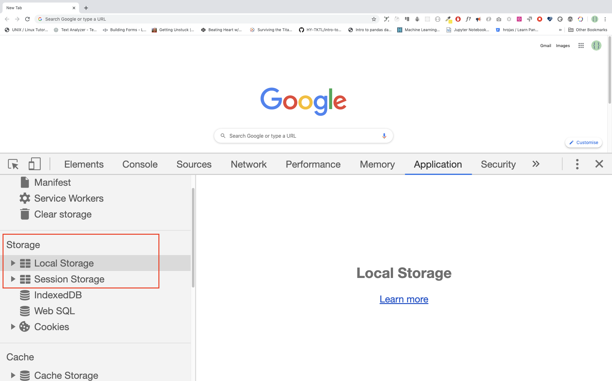
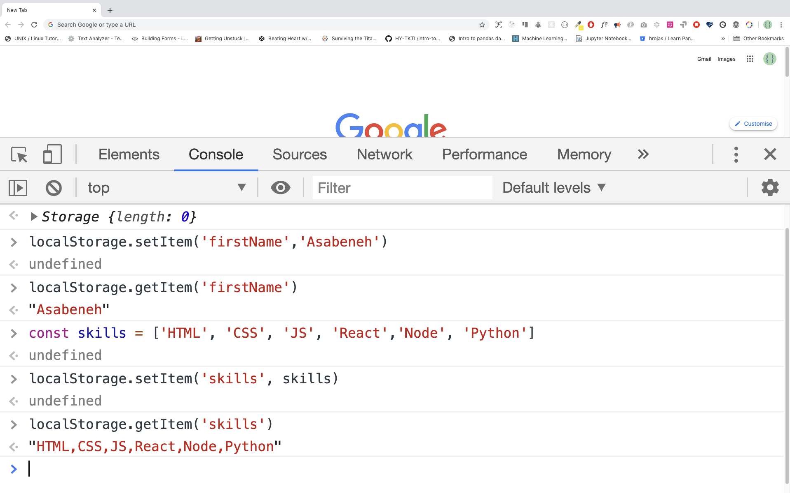

# 📘 Hari 17

## HTML5 Web Storage

Web Storage (sessionStorage dan localStorage) adalah API HTML5 baru yang menawarkan keuntungan penting dibandingkan cookie tradisional. Sebelum HTML5, data aplikasi harus disimpan dalam cookie, disertakan dalam setiap permintaan server. Web storage lebih aman, dan data dalam jumlah besar dapat disimpan secara lokal, tanpa memengaruhi kinerja situs web. Batas penyimpanan data cookie di banyak browser web adalah sekitar 4 KB per cookie. Web Storage dapat menyimpan data yang jauh lebih besar (setidaknya 5MB) dan tidak pernah ditransfer ke server. Semua situs dari origin yang sama dapat menyimpan dan mengakses data yang sama.

Data yang disimpan dapat diakses menggunakan JavaScript, yang memberi Anda kemampuan untuk memanfaatkan client-side scripting untuk melakukan banyak hal yang sebelumnya melibatkan server-side programming dan database relasional. Ada dua objek Web Storage:

- sessionStorage
- localStorage

localStorage mirip dengan sessionStorage, kecuali bahwa data yang disimpan di localStorage tidak memiliki waktu kedaluwarsa, sementara data yang disimpan di sessionStorage akan dihapus ketika sesi halaman berakhir — yaitu, ketika halaman ditutup.

Perlu dicatat bahwa data yang disimpan di localStorage atau sessionStorage bersifat spesifik terhadap protokol halaman.

Kunci dan nilainya selalu berupa string (perhatikan bahwa, seperti objek, kunci integer akan secara otomatis dikonversi menjadi string).



### sessionStorage

sessionStorage hanya tersedia di dalam tab atau jendela browser. Ini dirancang untuk menyimpan data dalam satu sesi halaman web. Artinya, jika jendela ditutup, data sesi akan dihapus. Karena sessionStorage dan localStorage memiliki method yang serupa, kita akan fokus hanya pada localStorage.

### localStorage

localStorage HTML5 adalah bagian dari web storage API yang digunakan untuk menyimpan data di browser tanpa data kedaluwarsa. Data akan tersedia di browser bahkan setelah browser ditutup. localStorage tetap ada bahkan di antara sesi browser. Ini berarti data masih tersedia ketika browser ditutup dan dibuka kembali, dan juga secara instan di antara tab dan jendela.

Data Web Storage, dalam kedua kasus, tidak tersedia di antara browser yang berbeda. Misalnya, objek penyimpanan yang dibuat di Firefox tidak dapat diakses di Internet Explorer, persis seperti cookie. Ada lima method untuk bekerja dengan local storage:
_setItem(), getItem(), removeItem(), clear(), key()_

### Kasus Penggunaan Web Storage

Beberapa kasus penggunaan Web Storage adalah:

- menyimpan data sementara
- menyimpan produk yang dimasukkan pengguna ke keranjang belanjanya
- data dapat tersedia di antara permintaan halaman, beberapa tab browser, dan juga di antara sesi browser menggunakan localStorage
- dapat digunakan secara offline sepenuhnya menggunakan localStorage
- Web Storage dapat menjadi peningkatan performa yang besar ketika beberapa data statis disimpan di klien untuk meminimalkan jumlah permintaan berikutnya. Bahkan gambar dapat disimpan dalam string menggunakan encoding Base64.
- dapat digunakan untuk metode autentikasi pengguna

Untuk contoh-contoh yang disebutkan di atas, masuk akal untuk menggunakan localStorage. Anda mungkin bertanya-tanya, lalu, kapan kita harus menggunakan sessionStorage.

Dalam kasus di mana kita ingin menyingkirkan data segera setelah jendela ditutup. Atau, mungkin, jika kita tidak ingin aplikasi saling mengganggu dengan aplikasi yang sama yang terbuka di jendela lain. Skenario ini paling cocok dilayani dengan sessionStorage.

Sekarang, mari kita lihat bagaimana menggunakan API Web Storage ini.

## Objek HTML5 Web Storage

HTML web storage menyediakan dua objek untuk menyimpan data di klien:

- window.localStorage - menyimpan data tanpa tanggal kedaluwarsa
- window.sessionStorage - menyimpan data untuk satu sesi (data hilang ketika tab browser ditutup). Sebagian besar browser modern mendukung Web Storage, namun ada baiknya untuk memeriksa dukungan browser untuk localStorage dan sessionStorage. Mari kita lihat method yang tersedia untuk objek Web Storage.

Objek Web Storage:

- _localStorage_ - untuk menampilkan objek localStorage
- _localStorage.clear()_ - untuk menghapus semua yang ada di local storage
- _localStorage.setItem()_ - untuk menyimpan data di localStorage. Method ini menerima parameter key dan value.
- _localStorage.getItem()_ - untuk menampilkan data yang disimpan di localStorage. Method ini menerima key sebagai parameter.
- _localStorage.removeItem()_ - untuk menghapus item yang tersimpan dari localStorage. Method ini menerima key sebagai parameter.
- _localStorage.key()_ - untuk menampilkan data yang disimpan di localStorage. Method ini menerima index sebagai parameter.



### Menyimpan Item ke localStorage

Ketika kita menyimpan data di localStorage, data akan disimpan sebagai string. Jika kita menyimpan array atau objek, kita harus melakukan stringify terlebih dahulu untuk mempertahankan formatnya, jika tidak, kita akan kehilangan struktur array atau struktur objek dari data aslinya.

Kita menyimpan data di localStorage menggunakan method _localStorage.setItem_.

```js
//syntax
localStorage.setItem('key', 'value')
```

- Menyimpan string di localStorage

```js
localStorage.setItem('firstName', 'Asabeneh') // since the value is string we do not stringify it
console.log(localStorage)
```

```sh
Storage {firstName: 'Asabeneh', length: 1}
```

- Menyimpan number di local storage

```js
localStorage.setItem('age', 200)
console.log(localStorage)
```

```sh
 Storage {age: '200', firstName: 'Asabeneh', length: 2}
```

- Menyimpan array di localStorage. Jika kita menyimpan array, objek, atau array objek, kita harus melakukan stringify terlebih dahulu. Lihat contoh di bawah ini.

```js
const skills = ['HTML', 'CSS', 'JS', 'React']
//Skills array has to be stringified first to keep the format.
const skillsJSON = JSON.stringify(skills, undefined, 4)
localStorage.setItem('skills', skillsJSON)
console.log(localStorage)
```

```sh
Storage {age: '200', firstName: 'Asabeneh', skills: 'HTML,CSS,JS,React', length: 3}
```

```js
let skills = [
  { tech: 'HTML', level: 10 },
  { tech: 'CSS', level: 9 },
  { tech: 'JS', level: 8 },
  { tech: 'React', level: 9 },
  { tech: 'Redux', level: 10 },
  { tech: 'Node', level: 8 },
  { tech: 'MongoDB', level: 8 }
]

let skillJSON = JSON.stringify(skills)
localStorage.setItem('skills', skillJSON)
```

- Menyimpan objek di localStorage. Sebelum kita menyimpan objek ke localStorage, objek tersebut harus di-stringify.

```js
const user = {
  firstName: 'Asabeneh',
  age: 250,
  skills: ['HTML', 'CSS', 'JS', 'React']
}

const userText = JSON.stringify(user, undefined, 4)
localStorage.setItem('user', userText)
```

### Mengambil Item dari localStorage

Kita mengambil data dari local storage menggunakan method _localStorage.getItem()_.

```js
//syntax
localStorage.getItem('key')
```

```js
let firstName = localStorage.getItem('firstName')
let age = localStorage.getItem('age')
let skills = localStorage.getItem('skills')
console.log(firstName, age, skills)
```

```sh
 'Asabeneh', '200', '['HTML','CSS','JS','React']'
```

Seperti yang Anda lihat, skill dalam format string. Mari kita gunakan JSON.parse() untuk menguraikannya menjadi array normal.

```js
let skills = localStorage.getItem('skills')
let skillsObj = JSON.parse(skills, undefined, 4)
console.log(skillsObj)
```

```sh
['HTML','CSS','JS','React']
```

### Membersihkan localStorage

Method clear akan membersihkan semua yang tersimpan di local storage.

```js
localStorage.clear()
```

🌕 Anda bertekad kuat. Sekarang, Anda telah mengenal Web Storage dan tahu cara menyimpan data kecil di browser klien. Anda 17 langkah lebih maju menuju kehebatan. Sekarang lakukan beberapa latihan untuk otak dan otot Anda.

## Latihan

### Latihan: Level 1

1. Simpan nama depan, nama belakang, umur, negara, kota Anda di localStorage browser Anda.

### Latihan: Level 2

1. Buat objek student. Objek student akan memiliki kunci firstName, lastName, age, skills, country, enrolled, dan nilai untuk kunci-kunci tersebut. Simpan objek student di localStorage browser Anda.

### Latihan: Level 3

1. Buat objek bernama personAccount. Objek ini memiliki properti firstname, lastname, incomes, expenses dan method totalIncome, totalExpense, accountInfo, addIncome, addExpense, dan accountBalance. Incomes adalah sekumpulan pendapatan beserta deskripsinya dan expenses juga merupakan sekumpulan pengeluaran beserta deskripsinya.

🎉 SELAMAT ! 🎉
