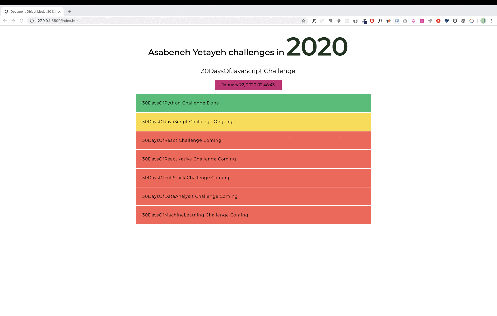

# 📙 Hari 21

## Document Object Model (DOM) - Hari 1

Nah, akhirnya kita nyampe juga di topik paling seru nih — DOM! Jadi gini, dokumen HTML itu sebenernya terstruktur sebagai Objek JavaScript, lho. Setiap elemen HTML punya properti-properti yang bisa kamu utak-atik sesuka hati. Kamu bisa ambil, bikin, nambahin, atau bahkan ngehapus elemen HTML pake JavaScript. Cakep kan?

Cara milih elemen HTML di JavaScript tuh mirip banget kayak kamu milih elemen pake CSS. Tinggal pake nama tag, id, nama kelas, atau atribut lainnya. Gampang, gas!

### Mendapatkan Elemen (Getting Element)

Kamu bisa ngakses elemen yang udah ada di HTML pake JavaScript. Buat ngakses atau ngambil elemen, kita pake berbagai metode yang udah disediain. Di kode bawah ini ada empat elemen _h1_. Yuk kita lihat gimana cara ngaksesnya!

```html
<!DOCTYPE html>
  <html lang="en">
    <head>
      <title>Document Object Model</title>
    </head>
    <body>

     <h1 class='title' id='first-title'>First Title</h1>
     <h1 class='title' id='second-title'>Second Title</h1>
     <h1 class='title' id='third-title'>Third Title</h1>
     <h1></h1>

    </body>
  </html>
```

#### Mendapatkan elemen berdasarkan nama tag

**_getElementsByTagName()_**: method ini nerima nama tag sebagai parameter string dan ngembaliin objek HTMLCollection. HTMLCollection itu kayak objek mirip array yang isinya elemen HTML. Properti length-nya ngasih tau ukuran koleksinya. Setiap kali kamu pake method ini, kamu bisa ngakses elemen individual pake indeks atau loop satu-satu. Cuma ya, HTMLCollection nggak mendukung semua method array biasa, jadi kamu harus pake for loop biasa ya, bukan forEach.

```js
// syntax
document.getElementsByTagName('tagname')
```

```js
const allTitles = document.getElementsByTagName('h1')

console.log(allTitles) //HTMLCollections
console.log(allTitles.length) // 4

for (let i = 0; i < allTitles.length; i++) {
  console.log(allTitles[i]) // prints each elements in the HTMLCollection
}
```

#### Mendapatkan elemen berdasarkan nama kelas

Method **_getElementsByClassName()_** juga ngembaliin objek HTMLCollection kok. HTMLCollection ini daftar mirip array dari elemen HTML. Properti length-nya ngasih tau ukuran koleksi. Kamu bisa loop semua elemennya, gampang banget. Cek contohnya di bawah ya!

```js
//syntax
document.getElementsByClassName('classname')
```

```js
const allTitles = document.getElementsByClassName('title')

console.log(allTitles) //HTMLCollections
console.log(allTitles.length) // 4

for (let i = 0; i < allTitles.length; i++) {
  console.log(allTitles[i]) // prints each elements in the HTMLCollection
}
```

#### Mendapatkan elemen berdasarkan id

**_getElementById()_** nah kalo yang ini cuma nargetin satu elemen HTML doang. Kamu tinggal kirim id-nya tanpa tanda # sebagai argumen. Simpel, kan?

```js
//syntax
document.getElementById('id')
```

```js
let firstTitle = document.getElementById('first-title')
console.log(firstTitle) // <h1>First Title</h1>
```

#### Mendapatkan elemen menggunakan metode querySelector

Method _document.querySelector_ bisa milih elemen HTML berdasarkan nama tag, id, atau nama kelas. Serba guna nih!

**_querySelector_**: bisa dipake buat milih elemen HTML berdasarkan nama tag, id, atau kelas. Kalau pake nama tag, dia cuma milih elemen pertama aja ya.

```js
let firstTitle = document.querySelector('h1') // select the first available h1 element
let firstTitle = document.querySelector('#first-title') // select id with first-title
let firstTitle = document.querySelector('.title') // select the first available element with class title
```

**_querySelectorAll_**: nah kalo yang ini bisa milih semua elemen html berdasarkan nama tag atau kelas. Dia ngembaliin nodeList — objek mirip array yang mendukung method array, mantap! Kamu bisa pake **_for loop_** atau **_forEach_** buat loop setiap elemennya.

```js
const allTitles = document.querySelectorAll('h1') # selects all the available h1 elements in the page

console.log(allTitles.length) // 4
for (let i = 0; i < allTitles.length; i++) {
  console.log(allTitles[i])
}

allTitles.forEach(title => console.log(title))
const allTitles = document.querySelectorAll('.title') // the same goes for selecting using class
```

### Menambahkan atribut

Atribut itu ditambahin di tag pembuka HTML, fungsinya ngasih informasi tambahan tentang elemen. Atribut HTML yang umum tuh kayak: id, class, src, style, href, disabled, title, alt. Yuk kita tambahin id dan class buat judul keempat!

```js
const titles = document.querySelectorAll('h1')
titles[3].className = 'title'
titles[3].id = 'fourth-title'
```

#### Menambahkan atribut menggunakan setAttribute

Method **_setAttribute()_** bisa ngeset atribut html apa aja. Dia nerima dua parameter: tipe atribut dan nama atribut. Gaskeun kita tambahin atribut class dan id buat judul keempat!

```js
const titles = document.querySelectorAll('h1')
titles[3].setAttribute('class', 'title')
titles[3].setAttribute('id', 'fourth-title')
```

#### Menambahkan atribut tanpa setAttribute

Kamu juga bisa pake cara setting objek biasa kok buat ngeset atribut. Tapi inget ya, cara ini nggak berlaku buat semua elemen. Beberapa atribut emang properti objek DOM dan bisa diset langsung, contohnya id dan class.

```js
//another way to setting an attribute
titles[3].className = 'title'
titles[3].id = 'fourth-title'
```

#### Menambahkan kelas menggunakan classList

Method classList tuh cara yang cakep buat nambahin kelas tambahan. Dia nggak bakal nimpa kelas asli kalo kelasnya udah ada, malah dia nambahin aja gitu. Keren, kan?

```js
//another way to setting an attribute: append the class, doesn't over ride
titles[3].classList.add('title', 'header-title')
```

#### Menghapus kelas menggunakan remove

Sama kayak nambahin, kamu juga bisa hapus kelas dari elemen. Tinggal panggil remove aja buat hapus kelas tertentu.

```js
//another way to setting an attribute: append the class, doesn't over ride
titles[3].classList.remove('title', 'header-title')
```

### Menambahkan Teks ke elemen HTML

Sebuah HTML itu kayak blok bangunan yang terdiri dari tag pembuka, tag penutup, dan konten teks. Kamu bisa nambahin konten teks pake properti _textContent_ atau _innerHTML_. Dua-duanya oke, tinggal pilih sesuai kebutuhan!

#### Menambahkan Konten Teks menggunakan textContent

Properti _textContent_ ini khusus buat nambahin teks ke elemen HTML. Fungsinya ya spesifik itu aja.

```js
const titles = document.querySelectorAll('h1')
titles[3].textContent = 'Fourth Title'
```

#### Menambahkan Konten Teks menggunakan innerHTML

Banyak yang suka bingung nih bedanya _textContent_ sama _innerHTML_. Gini lho, _textContent_ itu emang khusus buat nambahin teks doang. Nah kalo _innerHTML_ bisa lebih dari itu — dia bisa nambahin teks ATAU elemen HTML sebagai child. Jadi lebih fleksibel!

##### Konten Teks (Text Content)

Kita set properti *textContent* dari objek HTML langsung ke teks yang kita mau.

```js
const titles = document.querySelectorAll('h1')
titles[3].textContent = 'Fourth Title'
```

##### Inner HTML

Kita pake properti innerHTML kalo mau ngeganti atau nambahin konten child yang baru sama sekali ke elemen induk. Nilai yang kita set bakal berupa string yang isinya elemen HTML.

```html
<!DOCTYPE html>
<html lang="en">
  <head>
    <title>JavaScript for Everyone:DOM</title>
  </head>
  <body>
    <div class="wrapper">
        <h1>Asabeneh Yetayeh challenges in 2020</h1>
        <h2>30DaysOfJavaScript Challenge</h2>
        <ul></ul>
    </div>
    <script>
    const lists = `
    <li>30DaysOfPython Challenge Done</li>
            <li>30DaysOfJavaScript Challenge Ongoing</li>
            <li>30DaysOfReact Challenge Coming</li>
            <li>30DaysOfFullStack Challenge Coming</li>
            <li>30DaysOfDataAnalysis Challenge Coming</li>
            <li>30DaysOfReactNative Challenge Coming</li>
            <li>30DaysOfMachineLearning Challenge Coming</li>`
  const ul = document.querySelector('ul')
  ul.innerHTML = lists
    </script>
  </body>
</html>
```

Properti innerHTML juga bisa kamu pake buat ngapus semua child dari elemen induk, lho. Daripada repot-repot pake removeChild(), mending pake cara ini aja — lebih praktis!

```html
<!DOCTYPE html>
<html lang="en">
  <head>
    <title>JavaScript for Everyone:DOM</title>
  </head>
  <body>
    <div class="wrapper">
        <h1>Asabeneh Yetayeh challenges in 2020</h1>
        <h2>30DaysOfJavaScript Challenge</h2>
        <ul>
            <li>30DaysOfPython Challenge Done</li>
            <li>30DaysOfJavaScript Challenge Ongoing</li>
            <li>30DaysOfReact Challenge Coming</li>
            <li>30DaysOfFullStack Challenge Coming</li>
            <li>30DaysOfDataAnalysis Challenge Coming</li>
            <li>30DaysOfReactNative Challenge Coming</li>
            <li>30DaysOfMachineLearning Challenge Coming</li>
        </ul>
    </div>
    <script>
  const ul = document.querySelector('ul')
  ul.innerHTML = ''
    </script>
  </body>
</html>
```

### Menambahkan style

#### Menambahkan Style Warna

Yuk kita kasih style ke judul-judul kita! Kalo indeksnya genap kita kasih warna hijau, kalo ganjil merah. Seru, kan?

```js
const titles = document.querySelectorAll('h1')
titles.forEach((title, i) => {
  title.style.fontSize = '24px' // all titles will have 24px font size
  if (i % 2 === 0) {
    title.style.color = 'green'
  } else {
    title.style.color = 'red'
  }
})
```

#### Menambahkan Style Warna Latar Belakang

Sekarang kita utak-atik background-nya. Indeks genap = background hijau, indeks ganjil = background merah. Gampang!

```js
const titles = document.querySelectorAll('h1')
titles.forEach((title, i) => {
  title.style.fontSize = '24px' // all titles will have 24px font size
  if (i % 2 === 0) {
    title.style.backgroundColor = 'green'
  } else {
    title.style.backgroundColor = 'red'
  }
})
```

#### Menambahkan Style Ukuran Font

Sekarang coba kita mainin ukuran font. Indeks genap ukuran 20px, indeks ganjil 30px. Variatif dikit lah ya biar nggak bosen!

```js
const titles = document.querySelectorAll('h1')
titles.forEach((title, i) => {
  title.style.fontSize = '24px' // all titles will have 24px font size
  if (i % 2 === 0) {
    title.style.fontSize = '20px'
  } else {
    title.style.fontSize = '30px'
  }
})
```

Nah, satu hal penting yang harus kamu inget: properti CSS kalo ditulis di JavaScript itu jadi camelCase. Jadi background-color jadi backgroundColor, font-size jadi fontSize, font-family jadi fontFamily, margin-bottom jadi marginBottom. Jangan sampe salah tulis ya!

---

🌕 Gila sih, sekarang kamu udah penuh dengan kekuatan super! Kamu udah ngelewatin bagian paling penting dan menantang dari tantangan ini — dan JavaScript secara umum. Kamu udah belajar DOM dan sekarang kamu punya kemampuan buat bikin dan ngembangin aplikasi. Mantap! Sekarang gaskeun kerjain beberapa latihan buat otak dan tangan kamu!

## Latihan

### Latihan: Level 1

1. Bikin file index.html dan taruh empat elemen p kayak di atas: Ambil paragraf pertama pake **_document.querySelector(tagname)_** dan nama tag
2. Ambil masing-masing paragraf pake **_document.querySelector('#id')_** dan id mereka
3. Ambil semua p sebagai nodeList pake **_document.querySelectorAll(tagname)_** dan nama tag mereka
4. Loop nodeList-nya dan ambil konten teks dari setiap paragraf
5. Set konten teks ke paragraf keempat jadi **_Fourth Paragraph_**
6. Set atribut id dan class buat semua paragraf pake berbagai metode pengaturan atribut

### Latihan: Level 2

1. Ubah style setiap paragraf pake JavaScript (mis. color, background, border, font-size, font-family)
1. Pilih semua paragraf, loop setiap elemennya, terus paragraf pertama dan ketiga kasih warna hijau, paragraf kedua dan keempat kasih warna merah
1. Set konten teks, id, dan class ke setiap paragraf

### Latihan: Level 3

#### DOM: Mini project 1

1. Kembangin aplikasi berikut nih, pake elemen HTML di bawah buat mulai. Kamu bakal dapet kode yang sama di folder starter. Terapin semua style dan fungsionalitasnya CUMA pake JavaScript aja ya!

   - Warna tahun berubah setiap 1 detik
   - Warna latar belakang tanggal dan waktu berubah setiap detik
   - Tantangan yang udah completed kasih background hijau
   - Tantangan yang lagi ongoing kasih background kuning
   - Tantangan yang coming soon kasih background merah

```html
<!-- index.html -->
<!DOCTYPE html>
<html lang="en">
  <head>
    <title>JavaScript for Everyone:DOM</title>
  </head>
  <body>
    <div class="wrapper">
        <h1>Asabeneh Yetayeh challenges in 2020</h1>
        <h2>30DaysOfJavaScript Challenge</h2>
        <ul>
            <li>30DaysOfPython Challenge Done</li>
            <li>30DaysOfJavaScript Challenge Ongoing</li>
            <li>30DaysOfReact Challenge Coming</li>
            <li>30DaysOfFullStack Challenge Coming</li>
            <li>30DaysOfDataAnalysis Challenge Coming</li>
            <li>30DaysOfReactNative Challenge Coming</li>
            <li>30DaysOfMachineLearning Challenge Coming</li>
        </ul>
    </div>
  </body>
</html>
```




🎉 SELAMAT ! 🎉
