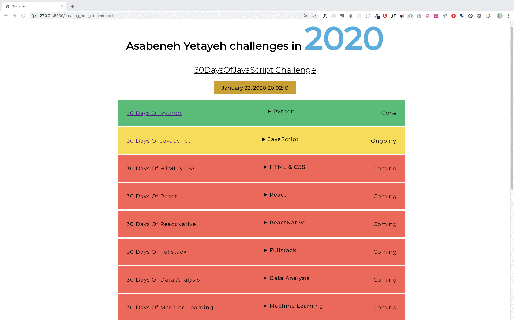
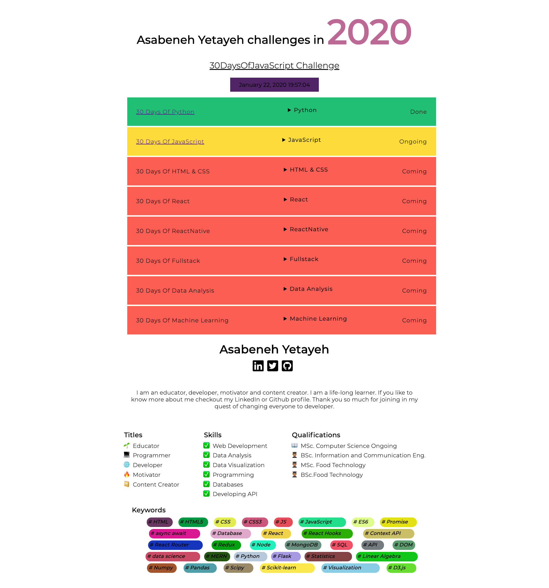

# 📙 Hari 22

## DOM(Document Object Model)-Hari 2

### Membuat Elemen

Buat bikin elemen HTML kita pake nama tag. Serius deh, bikin elemen HTML pake JavaScript tuh gampang banget. Kamu tinggal pake method _document.createElement()_. Method ini nerima nama tag elemen HTML sebagai parameter string. Simpel!

```js
// syntax
document.createElement('tagname')
```

```html
<!DOCTYPE html>
<html>

<head>
    <title>Document Object Model:30 Days Of JavaScript</title>
</head>

<body>

    <script>
        let title = document.createElement('h1')
        title.className = 'title'
        title.style.fontSize = '24px'
        title.textContent = 'Creating HTML element DOM Day 2'

        console.log(title)
    </script>
</body>

</html>
```

### Membuat banyak elemen

Kalo mau bikin banyak elemen, kita harus pake perulangan dong. Dengan loop, kamu bisa bikin elemen HTML sebanyak yang kamu mau. Setelah bikin elemennya, kamu tinggal set deh nilai-nilai ke berbagai properti objek HTML-nya. Gas pol!

```html
<!DOCTYPE html>
<html>

<head>
    <title>Document Object Model:30 Days Of JavaScript</title>
</head>

<body>

    <script>
        let title
        for (let i = 0; i < 3; i++) {
            title = document.createElement('h1')
            title.className = 'title'
            title.style.fontSize = '24px'
            title.textContent = i
            console.log(title)
        }
    </script>
</body>

</html>
```

### Menambahkan child ke elemen parent

Nah biar elemen yang kamu bikin keliatan di dokumen HTML, kamu harus nambahin dia ke parent sebagai elemen child. Kamu bisa ngakses body dokumen HTML pake *document.body*. *document.body* mendukung method *appendChild()*. Cek contoh di bawah ya!

```html
<!DOCTYPE html>
<html>

<head>
    <title>Document Object Model:30 Days Of JavaScript</title>
</head>

<body>

    <script>
        // membuat banyak elemen dan menambahkannya ke elemen parent
        let title
        for (let i = 0; i < 3; i++) {
            title = document.createElement('h1')
            title.className = 'title'
            title.style.fontSize = '24px'
            title.textContent = i
            document.body.appendChild(title)
        }
    </script>
</body>
</html>
```

### Menghapus elemen child dari node parent

Setelah bikin HTML, pasti ada kalanya kamu pengen ngehapus elemen juga dong. Nah, kamu bisa pake method *removeChild()* buat itu.

**Contoh:**

```html
<!DOCTYPE html>
<html>

<head>
    <title>Document Object Model:30 Days Of JavaScript</title>
</head>

<body>
    <h1>Removing child Node</h1>
    <h2>Asabeneh Yetayeh challenges in 2020</h1>
    <ul>
        <li>30DaysOfPython Challenge Done</li>
        <li>30DaysOfJavaScript Challenge Done</li>
        <li>30DaysOfReact Challenge Coming</li>
        <li>30DaysOfFullStack Challenge Coming</li>
        <li>30DaysOfDataAnalysis Challenge Coming</li>
        <li>30DaysOfReactNative Challenge Coming</li>
        <li>30DaysOfMachineLearning Challenge Coming</li>
    </ul>

    <script>
        const ul = document.querySelector('ul')
        const lists = document.querySelectorAll('li')
        for (const list of lists) {
            ul.removeChild(list)

        }
    </script>
</body>

</html>
```

Tapi kayak yang udah kita lihat di bagian sebelumnya, sebenernya ada cara yang lebih cakep buat ngehapus semua elemen HTML inner atau children dari elemen parent — pake property *innerHTML* aja!

```html
<!DOCTYPE html>
<html>

<head>
    <title>Document Object Model:30 Days Of JavaScript</title>
</head>

<body>
    <h1>Removing child Node</h1>
    <h2>Asabeneh Yetayeh challenges in 2020</h1>
    <ul>
        <li>30DaysOfPython Challenge Done</li>
        <li>30DaysOfJavaScript Challenge Done</li>
        <li>30DaysOfReact Challenge Coming</li>
        <li>30DaysOfFullStack Challenge Coming</li>
        <li>30DaysOfDataAnalysis Challenge Coming</li>
        <li>30DaysOfReactNative Challenge Coming</li>
        <li>30DaysOfMachineLearning Challenge Coming</li>
    </ul>

    <script>
        const ul = document.querySelector('ul')
        ul.innerHTML = ''
    </script>
</body>

</html>
```

Simpel banget kan? Potongan kode di atas langsung ngehapus semua elemen child dalam satu baris doang!

---

🌕 Kamu tuh keren banget sih, terus berkembang setiap hari. Sekarang, kamu udah tau cara menghancurkan elemen DOM yang udah dibuat kalo udah nggak diperlukan lagi. Kamu udah paham DOM dan sekarang kamu punya kemampuan buat bikin dan ngembangin aplikasi. Tinggal delapan hari lagi menuju level dewa! Yuk sekarang kerjain latihan buat otak dan otot kamu!

## Latihan

### Latihan: Level 1

1. Bikin sebuah container div pada dokumen HTML dan bikin angka 0 sampai 100 secara dinamis, terus tambahin ke container div tersebut.
   - Background angka genap warna hijau
   - Background angka ganjil warna kuning
   - Background angka prima warna merah


### Latihan: Level 2

1. Pake array countries buat nampilin semua negara. Cek desainnya nih!


### Latihan: Level 3

Cek requirement proyek ini dari kedua gambar (jpg dan gif). Semua data dan CSS udah diimplementasikan cuma pake JavaScript doang lho! Data bisa ditemuin di folder starter project_3. Tombol dropdown-nya dibuat pake elemen HTML [*details*](https://www.w3schools.com/tags/tag_details.asp).





🎉 SELAMAT ! 🎉
