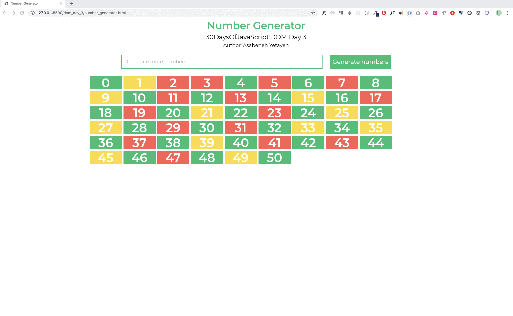

# 📙 Hari 23

## DOM(Document Object Model)-Hari 3

### Event Listener

Oke gas, sekarang kita masuk ke event listener! Jadi event HTML yang umum tuh kayak: onclick, onchange, onmouseover, onmouseout, onkeydown, onkeyup, onload.

Kita bisa nambahin method event listener ke objek DOM apa pun. Caranya pake method **_addEventListener()_** buat "mendengarkan" berbagai jenis event pada elemen HTML. Method _addEventListener()_ ini nerima dua argumen: event listener dan callback function. Gampang, kan?

```js
selectedElement.addEventListener('eventlistner', function(e) {
  // aktivitas yang ingin Anda lakukan setelah event akan berada di sini
})
// atau

selectedElement.addEventListener('eventlistner', e => {
  // aktivitas yang ingin Anda lakukan setelah event akan berada di sini
})
```

#### Click

Buat nempelin event listener ke elemen, pertama kita pilih dulu elemennya, terus kita tempelin method addEventListener. Event listener nerima jenis event dan callback function sebagai argumen.

Nih contoh event jenis click.

**Contoh: click**

```html
<!DOCTYPE html>
<html>
  <head>
    <title>Document Object Model</title>
  </head>

  <body>
    <button>Click Me</button>

    <script>
      const button = document.querySelector('button')
      button.addEventListener('click', e => {
        console.log('e gives the event listener object:', e)
        console.log('e.target gives the selected element: ', e.target)
        console.log(
          'e.target.textContent gives content of selected element: ',
          e.target.textContent
        )
      })
    </script>
  </body>
</html>
```

Event juga bisa langsung ditempel ke elemen HTML sebagai inline script lho!

**Contoh: onclick**

```html
<!DOCTYPE html>
<html>
  <head>
    <title>Document Object Model</title>
  </head>

  <body>
    <button onclick="clickMe()">Click Me</button>
    <script>
      const clickMe = () => {
        alert('We can attach event on HTML element')
      }
    </script>
  </body>
</html>
```

#### Double Click

Buat nempelin event listener ke elemen, pertama kita pilih dulu elemennya, terus tempelin method addEventListener. Event listener nerima jenis event dan callback function sebagai argumen.

Nih contoh event jenis double click ya.
**Contoh: dblclick**

```html
<!DOCTYPE html>
<html>
  <head>
    <title>Document Object Model</title>
  </head>

  <body>
    <button>Click Me</button>
    <script>
      const button = document.querySelector('button')
      button.addEventListener('dblclick', e => {
        console.log('e gives the event listener object:', e)
        console.log('e.target gives the selected element: ', e.target)
        console.log(
          'e.target.textContent gives content of selected element: ',
          e.target.textContent
        )
      })
    </script>
  </body>
</html>
```

#### Mouse Enter

Buat nempelin event listener, pilih dulu elemennya terus tempelin method addEventListener. Event listener nerima jenis event dan callback function sebagai argumen.

Nih contoh event jenis mouse enter.

**Contoh: mouseenter**

```html
<!DOCTYPE html>
<html>
  <head>
    <title>Document Object Model</title>
  </head>

  <body>
    <button>Click Me</button>
    <script>
      const button = document.querySelector('button')
      button.addEventListener('mouseenter', e => {
        console.log('e gives the event listener object:', e)
        console.log('e.target gives the selected element: ', e.target)
        console.log(
          'e.target.textContent gives content of selected element: ',
          e.target.textContent
        )
      })
    </script>
  </body>
</html>
```

Nah sekarang kamu udah familiar dong sama method addEventListener dan cara nempelin event listener. Sebenernya ada banyak banget jenis event listener, tapi di tantangan ini kita fokus ke yang paling umum dan penting aja dulu ya.

Daftar event nih biar kamu tau:

- click - saat elemen diklik
- dblclick - saat elemen diklik dua kali
- mouseenter - saat pointer mouse masuk ke elemen
- mouseleave - saat pointer mouse ninggalin elemen
- mousemove - saat pointer mouse gerak di atas elemen
- mouseover - saat pointer mouse gerak di atas elemen
- mouseout - saat pointer mouse keluar dari elemen
- input - saat nilai dimasukin ke field input
- change - saat nilai berubah pada field input
- blur - saat elemen nggak fokus
- keydown - saat sebuah tombol ditekan
- keyup - saat sebuah tombol dilepas
- keypress - saat kita menekan tombol apa pun
- onload - saat browser udah selesai loading halaman

Coba deh tes jenis event di atas dengan ganti-ganti jenis event di potongan kode di atas. Eksperimen aja!

### Mendapatkan nilai dari elemen input

Biasanya kita ngisi formulir dan formulir nerima data. Field formulir dibuat pake elemen HTML input. Yuk kita bikin aplikasi kecil yang bisa ngitung indeks massa tubuh (BMI) seseorang pake dua field input, satu tombol, dan satu tag p. Seru nih!

### input value

```html
<!DOCTYPE html>
<html>
  <head>
    <title>Document Object Model:30 Days Of JavaScript</title>
  </head>

  <body>
    <h1>Body Mass Index Calculator</h1>

    <input type="text" id="mass" placeholder="Mass in Kilogram" />
    <input type="text" id="height" placeholder="Height in meters" />
    <button>Calculate BMI</button>

    <script>
      const mass = document.querySelector('#mass')
      const height = document.querySelector('#height')
      const button = document.querySelector('button')

      let bmi
      button.addEventListener('click', () => {
        bmi = mass.value / height.value ** 2
        alert(`your bmi is ${bmi.toFixed(2)}`)
        console.log(bmi)
      })
    </script>
  </body>
</html>
```

#### event input dan change

Di contoh di atas, kita berhasil dapetin nilai input dari dua field input dengan mengklik tombol. Tapi gimana kalo kamu pengen dapetin nilainya tanpa ngeklik tombol? Bisa dong! Kamu tinggal pake jenis event _change_ atau _input_ buat dapetin data langsung dari field input saat field lagi fokus. Yuk lihat caranya!

```html
<!DOCTYPE html>
<html>
  <head>
    <title>Document Object Model:30 Days Of JavaScript</title>
  </head>

  <body>
    <h1>Data Binding using input or change event</h1>

    <input type="text" placeholder="say something" />
    <p></p>

    <script>
      const input = document.querySelector('input')
      const p = document.querySelector('p')

      input.addEventListener('input', e => {
        p.textContent = e.target.value
      })
    </script>
  </body>
</html>
```

#### event blur

Nah kalo event _blur_ ini beda dari _input_ atau _change_. Event _blur_ terjadi saat field input lagi nggak dalam keadaan fokus. Jadi pas kamu klik di luar field-nya, baru deh dia jalan.

```js
<!DOCTYPE html>
<html>

<head>
    <title>Document Object Model:30 Days Of JavaScript</title>
</head>

<body>
    <h1>Giving feedback using blur event</h1>

    <input type="text" id="mass" placeholder="say something" />
    <p></p>

    <script>
        const input = document.querySelector('input')
        const p = document.querySelector('p')

        input.addEventListener('blur', (e) => {
            p.textContent = 'Field is required'
            p.style.color = 'red'

        })
    </script>
</body>

</html>
```

#### keypress, keydown dan keyup

Kamu juga bisa ngakses semua kode tombol keyboard pake berbagai jenis event listener. Keren kan? Yuk kita pake keypress dan dapetin keyCode dari setiap tombol keyboard!

```html
<!DOCTYPE html>
<html>
  <head>
    <title>Document Object Model:30 Days Of JavaScript</title>
  </head>

  <body>
    <h1>Key events: Press any key</h1>

    <script>
      document.body.addEventListener('keypress', e => {
        alert(e.keyCode)
      })
    </script>
  </body>
</html>
```

---

🌕 Kamu emang spesial, terus berkembang setiap hari! Sekarang kamu udah tau cara nanganin berbagai jenis event DOM. Tinggal tujuh hari lagi menuju level dewa nih! Gaskeun kerjain latihan buat otak dan otot kamu!

## Latihan

### Latihan: Level 1

1. Bikin angka dan tandain bilangan genap, ganjil, dan prima dengan tiga warna berbeda. Lihat gambar di bawah ya!



1. Bikin kode keyboard pake event listener. Cek gambar di bawah!


🎉 SELAMAT ! 🎉
