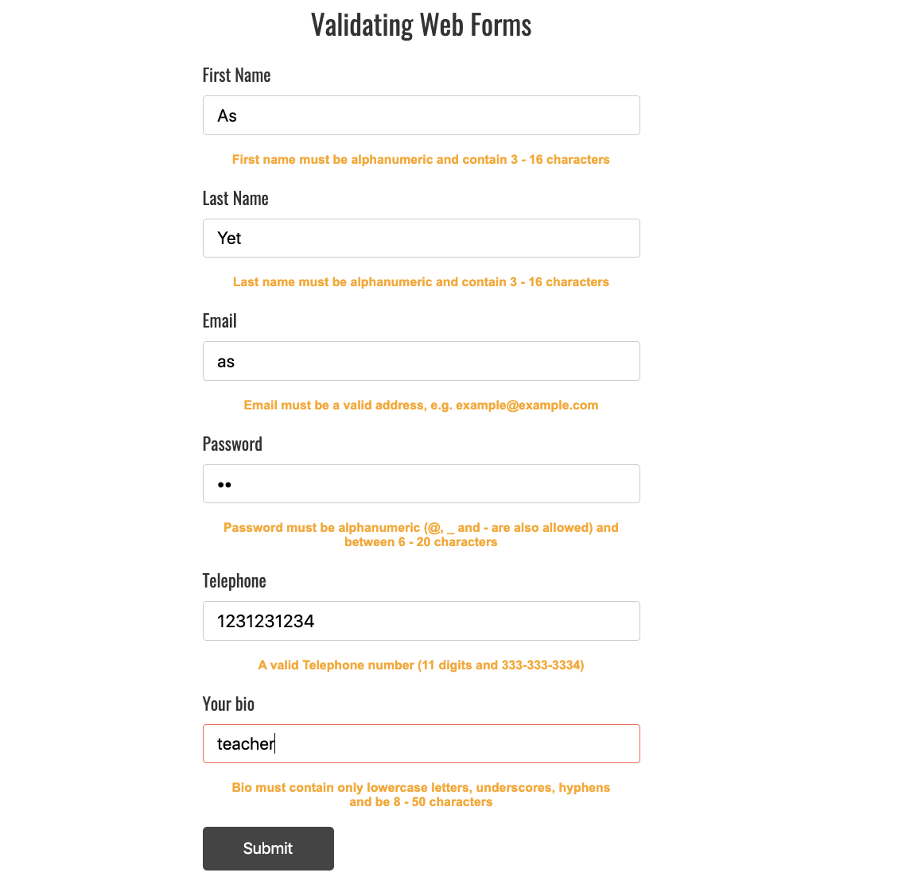
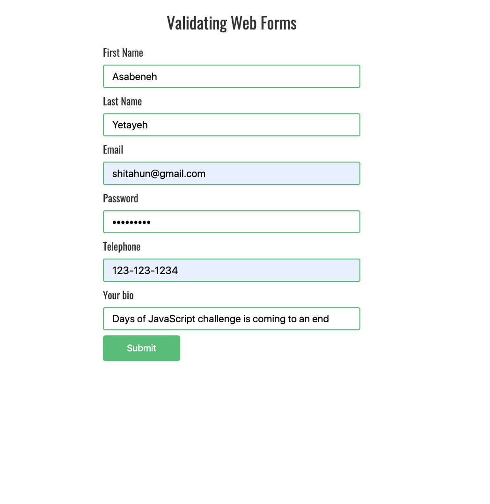
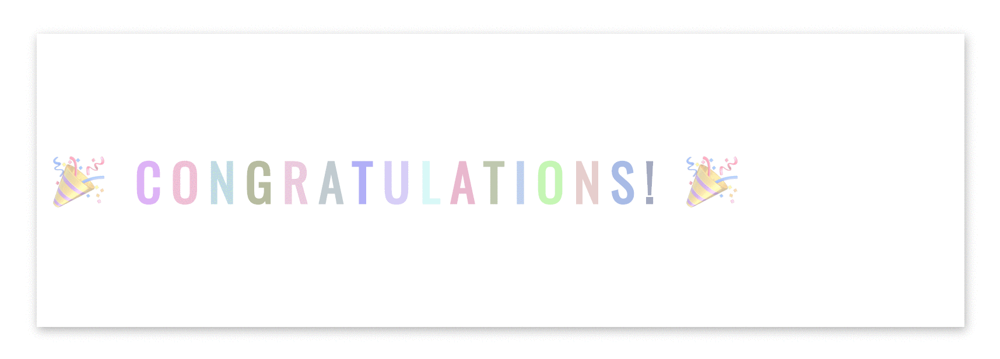

# 📔 Hari 30

## Latihan

### Latihan: Level 1

1. Gaskeun bikin animasi keren ini pakai (HTML, CSS, JS): 

2. Validasi form berikut pakai regex ya, santuy aja:

   

   

### Latihan: Level 2

### Latihan: Level 3

🌕 Wih, perjalanan keren kamu udah sampai di garis finish nih! Kamu udah naik level banget dan sekarang skill kamu makin gacor. Serius deh, gue tau perjuangan buat sampai di titik ini nggak gampang, tapi kamu berhasil ngelewatin semuanya. Kamu itu the real MVP! Sekarang waktunya rayain pencapaian gede ini bareng temen atau keluarga. Santuy dulu, kamu pantas kok! Gue tunggu kamu di tantangan seru berikutnya ya!

## Testimoni

Sekarang saatnya kasih dukungan ke penulis dan ceritain pendapat kamu tentang 30DaysOfJavaScript. Bisa tinggalin testimoni kamu di [link ini](https://testimonify.herokuapp.com/)

## Dukungan

Kamu bisa support penulis biar makin semangat bikin materi edukasi keren lainnya

